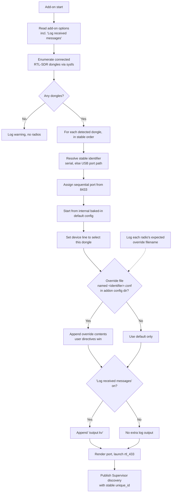
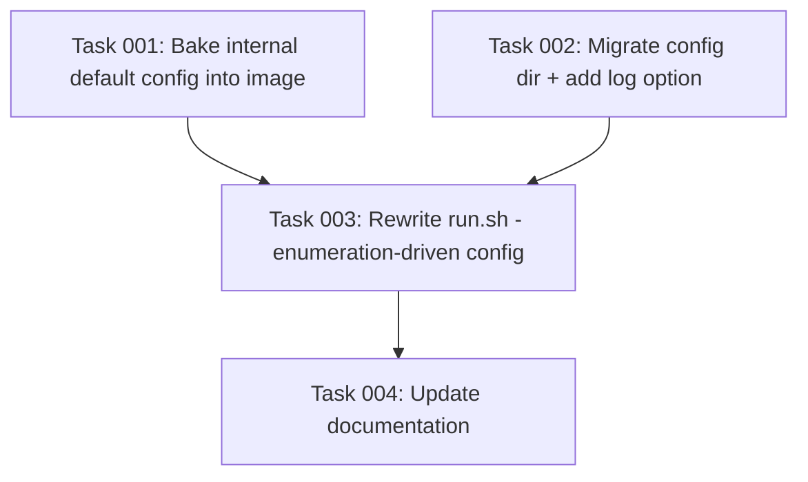

# Plan: Simplify rtl_433 Add-on Configuration for End Users

## Original Work Order

> I would like to simplify how configuration works for end users. By default, they shouldn't have to edit configuration files at all. Instead, we have a default configuration file that is internal. Then, for each configured radio, users should be able to add additional configuration in the addon's config directory (not the home assistant config directory) that are appended to our default configuration.

> I have one more feature to add: the user should be able to check off an addon config option to "Log received messages" that adds `output kv` to the internal config, without the user having to manually create and edit a file. Investigate if we should also include `output log` or have a separate toggle for that one.

## Plan Clarifications

| Question | Answer |
| --- | --- |
| Keep reading the old HA config-dir location (`/config/rtl_433`) for back-compat, or clean break? | **Clean break.** The old location is no longer read. |
| Zero-config behavior (no user files present)? | **Enumerate all connected dongles and run every detected device automatically**, each with the internal default config. |
| How does a user add/customize radios? | **One file per radio**, dropped in the addon config directory; contents are appended to the internal default. |
| How is a per-radio file matched to a specific radio? | **Filename = the radio's resolved stable identifier** (USB serial when usable, else USB port path). Unmatched files are ignored with a warning. The add-on logs each detected radio's expected filename. |
| How are directive conflicts between the default and a user override handled? | **Append; user wins on conflict** (the user file is appended last, so rtl_433 last-wins semantics apply). The add-on supplies the correct `device` selection for the matched radio. |
| Should the "Log received messages" toggle also add `output log`? | **No.** `output kv` is the decoded device data ("received messages"); `output log` is rtl_433's internal diagnostic/status stream, a distinct concern. A single toggle adds `output kv` only. No second toggle is built now (YAGNI), with a documented extension point. |

## Executive Summary

Today the add-on requires users to author and edit rtl_433 configuration files in the **Home Assistant** config directory (`/config/rtl_433`). On first run it writes an editable `.conf.template` there, and the set of `*.conf.template` files (each carrying a `device` line) is what declares and configures every radio. This couples first-run usability to manual file editing and mixes add-on internals into the user's Home Assistant config space.

This plan inverts the model so the common case needs **zero file editing**. The default rtl_433 configuration becomes an internal artifact baked into the container image and is never surfaced to the user. At startup the add-on enumerates all connected RTL-SDR dongles and runs one rtl_433 process per detected dongle using that internal default. For customization, a user may drop an **optional, append-only override file per radio** into the **add-on's own config directory** (the `addon_config` map, surfaced to users at `/addon_configs/rtl433/`), naming each file after the radio's stable identifier so it is matched to exactly one physical dongle. The override's contents are appended to the internal default, and the user's directives win on conflict. A new **"Log received messages"** add-on option lets users enable `output kv` (decoded device data in the add-on log) from the add-on UI without touching any file.

This approach was chosen because it makes the add-on work out-of-the-box for the overwhelmingly common single/multi RTL-SDR case, keeps add-on internals out of the Home Assistant config directory, and preserves a clean, minimal escape hatch for advanced per-radio tuning. Because existing users have files in the old location, this is an intentional, clarified **breaking change** with no compatibility shim.

## Context

### Current State vs Target State

| Current State | Target State | Why? |
| --- | --- | --- |
| Config lives in the Home Assistant config dir (`/config/rtl_433`, `homeassistant_config:rw`). | Config lives in the add-on's own config dir (`addon_config:rw`, surfaced at `/addon_configs/rtl433/`). | Keep add-on internals out of the HA config space; matches the user's explicit request. |
| On first run the add-on writes an editable default `rtl_433.conf.template` into the user-visible directory. | The default config is baked into the image as an internal, non-user-editable file. | Users should never need to see or edit the default to get a working setup. |
| Radios are declared by the presence of `*.conf.template` files; at least one is needed and the default seeds one. | Radios are auto-detected by enumerating connected RTL-SDR dongles; every detected dongle runs automatically. | "By default, users shouldn't have to edit configuration files at all." |
| Each user file is the *entire* config for a radio and must include the HTTP output and a `device` line. | Each user file is an *optional, partial* override appended to the internal default; the add-on supplies `device` and port. | Minimize what the user must write; reduce footguns. |
| User files have no required naming relationship to physical hardware. | Each override file is named after the radio's stable identifier (serial / USB port path) and matched to one dongle. | Deterministic, restart-stable mapping of customization to hardware. |
| Enabling readable decoded-event logging requires hand-editing a config file to add `output kv`. | A "Log received messages" add-on option toggles `output kv` from the UI. | Common debugging need shouldn't require file editing. |
| The old `/config/rtl_433` location is read on every start. | The old location is ignored entirely (clean break). | Avoid maintaining a legacy code path the user does not want. |

### Background

- `rtl_433/run.sh` currently: ensures `/config/rtl_433` exists; writes a default `*.conf.template` if empty; renders each template by sourcing it as a bash heredoc (substituting `${port}` and arbitrary shell); sorts templates by their `device` value to assign stable ports starting at `8433`; launches one `rtl_433 -c` process per template; and publishes a best-effort Supervisor discovery message per radio with a stable `unique_id`.
- The script already contains robust hardware enumeration (`enumerate_rtlsdr_devices`) and stable-identifier resolution (`_serial_is_usable`, `resolve_radio_unique_id`) using sysfs and a known RTL-SDR VID:PID table. These building blocks are reused as the new driver of execution rather than being driven by template files.
- `rtl_433-next` ships only its own `config.json`, `build.json`, `README.md`, and `CHANGELOG.md`. CI (`.github/workflows/build-addon.yml`) copies `rtl_433/*` into `rtl_433-next/` with `cp -n` (no-clobber) at build time, so `run.sh`, `Dockerfile`, and any new baked default config are **shared** from `rtl_433/`, while each variant keeps its **own** `config.json`. Any `config.json` change (the `map` change and the new option) must therefore be applied to **both** `rtl_433/config.json` and `rtl_433-next/config.json`.
- Investigation of rtl_433 output formats: `output kv` is the colorful, column-based decoded device-data stream (the "received messages"); `output log` is rtl_433's own structured diagnostic/status log stream. They are distinct, which is why the toggle maps only to `output kv`.
- Non-RTL-SDR SDRs (SoapySDR/HackRF) are not discoverable via the sysfs RTL-SDR enumeration, so they are out of scope for zero-config auto-detection (see Risks).

## Architectural Approach

The implementation has five coordinated parts: (1) migrate the storage location to the add-on config directory; (2) bake the default config into the image; (3) make hardware enumeration the driver that runs every detected radio; (4) discover and append optional per-radio override files matched by identifier; and (5) add the "Log received messages" add-on option. Documentation is updated to match.

### Add-on Config Directory Migration
**Objective**: Move the configuration storage out of the Home Assistant config directory and into the add-on's own config directory, as explicitly requested.

Change the `map` entry in **both** `rtl_433/config.json` and `rtl_433-next/config.json` from `homeassistant_config:rw` to `addon_config:rw`. With this map the add-on's private config directory is mounted at `/config` inside the container and surfaced to users at `/addon_configs/rtl433/`. The add-on no longer creates or reads `/config/rtl_433`; user override files live directly in the add-on config directory. The old location is not read (clean break). No default file is ever written into the user-visible directory, satisfying "by default, users shouldn't have to edit configuration files at all."

### Internal Default Configuration Baked Into the Image
**Objective**: Provide a sane default rtl_433 configuration that users never see or edit.

Extract today's heredoc default into a standalone file under `rtl_433/` and `COPY` it into the image (e.g. under `/etc/rtl_433/`) via the `Dockerfile`. Its content mirrors the current default: `report_meta`, the HTTP output line using the `${port}` placeholder, the TPMS protocol disables, and a commented hint about `output kv`. It must **not** hard-code a physical `device`; the add-on injects the correct `device` selection per detected radio at render time. This file is the single source of truth appended to for every radio.

### Hardware Enumeration Drives Execution
**Objective**: Run every connected dongle automatically with no user input.

Reuse `enumerate_rtlsdr_devices` to list connected RTL-SDR dongles in stable order. For each detected dongle: resolve its stable identifier (serial when usable, else USB port path) reusing the existing serial-usability logic; assign the next sequential port starting at `8433`, capped at `MAX_RADIOS`; build the radio's config by starting from the internal default and setting a `device` line that selects this specific dongle (by serial selector when usable, otherwise by enumeration index). The template files no longer determine which radios run. If no dongles are detected, log a clear warning and exit/idle gracefully as today's non-Supervisor path does.

### Per-Radio Override Discovery and Append
**Objective**: Let users customize a specific radio by dropping one optional file, matched deterministically to hardware.

For each detected radio, after computing its identifier, look in the add-on config directory for a file named `<identifier>.conf`. If present, append its contents to that radio's config (after the default and the injected `device` line) so user directives win under rtl_433's last-wins semantics. The add-on logs, for each detected radio, the exact filename a user should create to customize it (so identifiers are discoverable without guessing). Override files in the directory that match no detected radio are ignored with a warning. The `${port}` placeholder substitution mechanism is preserved for the rendered config so the HTTP output line continues to resolve to the assigned port.

### "Log Received Messages" Add-on Option
**Objective**: Toggle readable decoded-event logging from the add-on UI without editing files.

Add a boolean add-on option (e.g. `log_received_messages`, default off) with matching `options` and `schema` entries in **both** `config.json` files. In `run.sh`, read it via bashio; when enabled, append `output kv` to every radio's rendered config so decoded device data appears in the add-on log. Only `output kv` is added — per the investigation, `output log` (rtl_433's diagnostic/status stream) is a separate concern and is intentionally not bundled; the option is structured so a separate diagnostics toggle could be added later if desired.

### Documentation Updates
**Objective**: Make the user-facing and agent-facing docs reflect the new model.

Update `rtl_433/README.md` (and the brief `rtl_433-next/README.md` where it overlaps) to describe: zero-config auto-detection, the add-on config directory location, naming an override file after a radio's identifier (with how to find the identifier from the logs), the append/last-wins semantics, the relationship to the baked-in default, and the new "Log received messages" option. Update `AGENTS.md` to note the new baked-in default config file and the add-on-config-dir model in the Structure section.

## Risk Considerations and Mitigation Strategies

Technical Risks

- **Non-RTL-SDR SDRs (SoapySDR/HackRF) are not auto-detected**: The sysfs enumeration only recognizes known RTL-SDR VID:PID pairs, so HackRF/SoapySDR users get no auto-detected radios under the new zero-config model.
    - **Mitigation**: Document the limitation clearly. Such devices were previously driven by an explicit template `device` string; capturing that advanced path is out of scope for this plan and can be a follow-up (e.g. an override file that also forces a device when nothing is auto-detected). Flag prominently in the README so affected users are not surprised.
- **`device` selector stability for dongles without a usable serial**: Falling back to an enumeration-index `device` can change if dongles are added/removed.
    - **Mitigation**: Reuse the existing identifier-resolution preference order (serial → USB port path) for both the override-file match and the discovery `unique_id`; document that flashing a unique serial or keeping a fixed USB port yields the most stable behavior (as the current README already advises).

Implementation Risks

- **Breaking change for existing users**: Files in `/config/rtl_433` stop being read and the storage location moves.
    - **Mitigation**: This is an explicitly confirmed clean break. Document the migration steps (move per-radio tuning into `<identifier>.conf` files in the new add-on config directory) in the README and changelog via a clear Conventional Commit so release-please surfaces it.
- **`device`/conflict handling in appended overrides**: A user override that itself sets `device` could repoint a radio and break the filename→hardware mapping.
    - **Mitigation**: The add-on injects the correct `device` for the matched radio; per the clarified decision the appended user value wins (last-wins). Document that overriding `device` in an override file is discouraged and explain the consequence.
- **Shared vs per-variant files in CI**: Forgetting that `config.json` is per-variant (not copied) while `run.sh`/`Dockerfile`/default config are shared.
    - **Mitigation**: Apply `config.json` changes to both variants; rely on the `cp -n` copy for the shared files; verify both add-ons pass the add-on linter in CI.

## Success Criteria

### Primary Success Criteria
1. With one or more RTL-SDR dongles connected and **no** user files present, the add-on auto-detects and runs one rtl_433 process per dongle on stable sequential ports starting at `8433`, using only the internal baked-in default — no file editing required.
2. The default configuration exists only inside the image (not written into any user-visible directory), and the add-on reads override files exclusively from the add-on config directory (`addon_config`), never from `/config/rtl_433`.
3. Creating a file named after a detected radio's logged identifier in the add-on config directory causes that file's directives to be appended to the radio's config, with user directives taking effect on conflict; a file matching no radio is ignored with a warning.
4. Enabling the "Log received messages" add-on option adds `output kv` to every radio's effective config (decoded events appear in the add-on log) with no file editing, and disabling it removes that output.
5. Both `rtl_433` and `rtl_433-next` build and pass the add-on linter, shellcheck, hadolint, and JSON lint checks.

## Self Validation

After implementation, perform these concrete checks:

1. **Static checks**: Run `pre-commit run --all-files` and confirm shellcheck (`run.sh`), hadolint (`Dockerfile`), and check-json (`config.json` files) all pass.
2. **Config schema sanity**: `jq` both `rtl_433/config.json` and `rtl_433-next/config.json` to confirm `map` contains `addon_config:rw`, no longer contains `homeassistant_config:rw`, and that `options` and `schema` both declare the new boolean log option with a default of `false`.
3. **Baked default present**: Confirm the `Dockerfile` `COPY`s the new default config file to its in-image path and that the file contains the HTTP output `${port}` placeholder and the TPMS protocol disables but no hard-coded physical `device`.
4. **Enumeration-driven run (mocked)**: Using the existing `SYSFS_USB_BASE` override to point at a mock sysfs tree with two fake RTL-SDR devices, dry-run the relevant `run.sh` logic (e.g. by stubbing the `rtl_433` launch) and confirm two radios are prepared on ports `8433` and `8434`, each with the default config and a correct `device` selection, and that the add-on logs each radio's expected override filename.
5. **Override append**: With the mock above, place a `<identifier>.conf` file containing a recognizable directive (e.g. `frequency 868M`) in the add-on config dir and confirm it is appended to exactly the matching radio's rendered config after the default; place a bogus `nonexistent.conf` and confirm it is ignored with a warning.
6. **Log toggle**: Set the log option on and confirm `output kv` is appended to every rendered radio config; set it off and confirm it is absent.

## Documentation

- **`rtl_433/README.md`**: Rewrite the "How it works", "Installation", and "Configuration" sections for the new model (auto-detection, add-on config dir, identifier-named override files, append/last-wins, the baked-in default, and the "Log received messages" option). Note the SoapySDR/HackRF auto-detection limitation.
- **`rtl_433-next/README.md`**: Update overlapping guidance to match.
- **`AGENTS.md`**: In the Structure section, note the new baked-in default config file and the add-on-config-dir model.
- **Changelog**: No hand-editing of `rtl_433/CHANGELOG.md`; rely on Conventional Commit messages (including a clear breaking-change note) so release-please generates the entry.

## Resource Requirements

### Development Skills
- Bash scripting (bashio, sysfs enumeration, rtl_433 config rendering).
- Home Assistant add-on configuration (`config.json` `map`, `options`, `schema`).
- Dockerfile authoring.
- Technical writing for user- and agent-facing docs.

### Technical Infrastructure
- Existing pre-commit toolchain (shellcheck, hadolint, check-json/yaml) and the CI add-on linter.
- rtl_433 runtime in the built image for behavioral validation; a mock sysfs tree (via `SYSFS_USB_BASE`) for enumeration tests.

## Notes

- Keep changes minimal and within the requested scope: do not add a separate `output log` toggle now, do not add a back-compat shim for the old location, and do not build auto-detection for non-RTL-SDR SDRs.
- Preserve the existing stable-port assignment (base `8433`, `MAX_RADIOS` cap) and the Supervisor discovery publication with stable `unique_id`.

## Execution Blueprint

**Validation Gates:**
- Reference: `/config/hooks/POST_PHASE.md`

### Dependency Diagram

No circular dependencies.

### ✅ Phase 1: Image artifact and manifest groundwork
**Parallel Tasks:**
- ✔️ Task 001: Bake the internal default rtl_433 config into the image (no dependencies)
- ✔️ Task 002: Migrate add-on config dir and add the "Log received messages" option (no dependencies)

### ✅ Phase 2: Entrypoint rewrite
**Parallel Tasks:**
- ✔️ Task 003: Rewrite run.sh for enumeration-driven config with per-radio append overrides (depends on: 001, 002)

### ✅ Phase 3: Documentation
**Parallel Tasks:**
- ✔️ Task 004: Update documentation for the new configuration model (depends on: 003)

### Post-phase Actions
Run `pre-commit run --all-files` after each phase that touches linted files; the final POST_EXECUTION validation runs the plan's Self Validation steps.

### Execution Summary
- Total Phases: 3
- Total Tasks: 4

## Execution Summary

**Status**: ✅ Completed Successfully
**Completed Date**: 2026-05-31

### Results
All four tasks across three phases completed and committed to the `feat/redo-config` branch:

- **Internal default baked into the image** — `rtl_433/rtl_433.defaults.conf` was extracted from the old run.sh heredoc (TPMS disables, `report_meta`, HTTP output with the `${port}` placeholder, the `device 0` line removed) and `COPY`ed to `/etc/rtl_433/rtl_433.defaults.conf` in the Dockerfile's final stage. (commit `f21cfd4`)
- **Add-on config dir + log option** — both `rtl_433` and `rtl_433-next` manifests switched `map` from `homeassistant_config:rw` to `addon_config:rw` and gained a boolean `log_received_messages` option (default off) with schema. (commit `db7a312`)
- **Entrypoint rewrite** — `run.sh` is now driven by RTL-SDR hardware enumeration: one rtl_433 process per detected dongle using the baked-in default, an injected `device` selector (serial when usable, else index), optional per-radio `<identifier>.conf` overrides appended from the add-on config dir (user wins on conflict), an appended `output kv` when the log option is on, an unmatched-override warning, and graceful idling when no dongle is present. Existing stable-port and Supervisor-discovery machinery preserved. (commit `827a328`, marked `BREAKING CHANGE`)
- **Documentation** — READMEs and AGENTS.md rewritten for the zero-config auto-detection model, per-radio overrides, the log option, the breaking change, and the SoapySDR/HackRF limitation. (commit `de2d99d`)

### Noteworthy Events
- `pre-commit` was not installed in the environment; it was installed locally (`pip install --user --break-system-packages pre-commit`) so the shellcheck/hadolint/check-json gates could be run for real. All pass.
- Self Validation was executed against a mock sysfs tree (two fake `0bda:2832` dongles) with stubbed `bashio`/`rtl_433`: confirmed ports 8433/8434, correct `device :SERIAL` injection, override appended only to the matching radio, stray-file warning, non-RTL-SDR/USB-interface nodes skipped, `${port}` substitution in the active output line, `output kv` appended exactly once per radio when the log option is on (and absent when off), and graceful idling in the zero-dongle case.
- Observed (cosmetic, non-blocking): the heredoc `${port}` substitution also expands `$` sequences inside the default config's *comments* in the ephemeral rendered `/tmp` copy (e.g. the literal `${port}` in a comment becomes the port number). This never reaches the user and does not affect any active directive; it is the same documented heredoc behavior that requires users to escape `$` in overrides.

### Necessary follow-ups
- The "Log received messages" option appends `output kv` only; a separate diagnostics toggle for rtl_433's `output log` was intentionally deferred (YAGNI) and can be added later if desired.
- Auto-detection covers RTL-SDR dongles only; supporting auto-run of SoapySDR/HackRF devices (which the sysfs enumeration cannot see) is a possible future enhancement.
