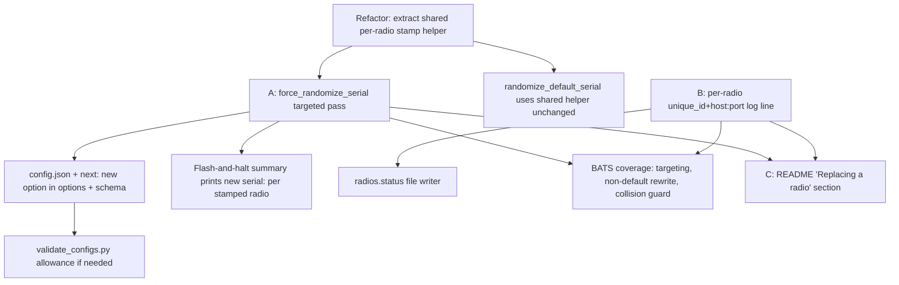
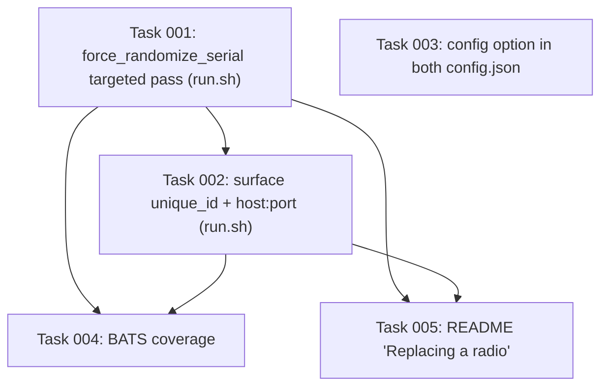

# Plan: Radio Replacement Support (Add-on side)

## Original Work Order
> read @RADIO_REPLACEMENT_PLAN.md and implement it.

The referenced `RADIO_REPLACEMENT_PLAN.md` (repo root) is the design brief. This
Strikethroo plan is the implementation-ready restatement of it, with the four
open decisions in that brief's §7 resolved (see Clarifications).

## Plan Clarifications

| Question | Decision |
|---|---|
| Selector format for `force_randomize_serial` | **USB port path** (e.g. `1-1.4`) — stable, already printed in logs, unambiguous for a single new radio. |
| How to surface each radio's `unique_id` + `host:port` | **Log line *and* a `radios.status` file** in the add-on config dir. |
| Stamp one radio per run, or a list | **One at a time** — single selector per run; matches "replace one dead radio". |
| Backwards-compatibility concerns | **None** — purely additive; the new option defaults to empty/off and leaves `randomize_default_serial` semantics untouched. |

## Executive Summary

When an RTL-SDR dongle identified by a writable-EEPROM serial dies, the user
replaces it and wants their existing Home Assistant entities, history, and
automations to keep working. The add-on identifies each radio by a stable
`unique_id` (`serial:` → `usbpath:` → `template:`). A replacement dongle that
ships with its *own* non-default serial advertises a **new** `serial:` identity,
so the integration no longer recognizes it. The agreed fix is to stamp the
replacement with a **fresh random** serial (never a clone of the dead one — two
live dongles must never share a serial), then re-link it in the companion
integration via its reconfigure workflow (paired plan, other repo).

This add-on plan delivers three things, all additive: **(A)** a new
`force_randomize_serial` option that runs the existing one-shot flash-and-halt
maintenance mode but targets **one** radio by USB port path and stamps it
regardless of whether its current serial is a factory default; **(B)** a
per-radio, copy-pasteable startup log line plus a `radios.status` file exposing
each radio's `unique_id` and `host:port` (the exact values the integration's
reconfigure step asks for), and the new serial after a stamp; and **(C)** a
"Replacing a radio" README section documenting the procedure and the
`serial:` vs `usbpath:` identity trade-off.

The approach was chosen to reuse the EEPROM write path corrected in PR #98
(librtlsdr-index-driven enumeration via `enumerate_rtlsdr_by_index` /
`list_rtlsdr_banner`), so targeting is correct even when the sysfs port-path
order disagrees with the librtlsdr index order. The genuinely new capability is
only the *targeted, not-default-gated* stamp; everything else is surfacing and
documentation.

## Context

### Current State vs Target State

| Current State | Target State | Why? |
|---|---|---|
| `randomize_default_serial` stamps **every** dongle whose serial is a factory default; a non-default serial is always left alone. | A new `force_randomize_serial` option stamps **one** user-selected radio (by USB port path) even when its serial is non-default. | A replacement dongle with its own non-default (possibly batch-shared) serial must be given a discardable fresh identity. |
| The per-radio stamping body lives inline in `flash_default_serials`. | The per-radio stamp (collision-safe random serial pick + bounded retrying `rtl_eeprom` write) is a shared helper used by both the all-defaults pass and the targeted pass. | DRY: one correct write path, two callers; keeps default-only semantics unchanged. |
| `unique_id` and `host:port` are computed but only appear piecemeal in logs (`Radio <id> -> HTTP port <port>`); the full `unique_id` is not surfaced per radio. | Each radio emits one clearly-formatted, copy-pasteable startup line `Radio <id>: unique_id=<...> host=<host> port=<port>`, and a `radios.status` file in the config dir lists `unique_id`, `host:port`, and current serial for every radio. | The integration's reconfigure step needs these exact values; the user should not have to scrape scattered log lines. |
| After a stamp, the flash-and-halt summary reports a count but not the new `serial:` identity each radio will advertise. | The flash-and-halt summary prints the **new** `serial:<new>` per stamped radio. | The user must know exactly what to bind in the integration after replugging. |
| No documentation of the replacement procedure or the `serial:`/`usbpath:` trade-off. | A "Replacing a radio" section in `rtl_433/README.md` (and `-next` if it diverges). | Users need the end-to-end procedure and guidance on which identity model to rely on. |

### Background

- **Hardware fact bounding the design:** an RTL-SDR serial *always* comes from a
  writable 24C02 EEPROM. "Has a unique serial" ⟺ "is rewritable". A no-EEPROM
  dongle only ever reports the default serial and is already `usbpath:`-identified;
  replacing it **in the same port** is transparent today and needs no stamping.
- **PR #98 correctness invariant (must be preserved):** `rtl_eeprom -d <index>`
  resolves the index through librtlsdr's own enumeration, which is **not**
  guaranteed to match `enumerate_rtlsdr_devices`' sysfs port-path sort. Any write
  must derive its `-d <index>` from `enumerate_rtlsdr_by_index`, reading the index
  and serial from the *same* enumeration the write targets. The targeted pass
  reuses this exact discipline; it must never assume the sysfs array position
  equals the librtlsdr index.
- **Existing helpers this plan builds on** (`rtl_433/run.sh`):
  `enumerate_rtlsdr_devices` (sysfs, emits `serial<TAB>portpath`),
  `enumerate_rtlsdr_by_index` (librtlsdr order, emits `index<TAB>serial`),
  `_portpath_for_serial`, `_serial_is_default`, `_serial_is_usable`,
  `generate_random_serial`, `flash_default_serials`, `resolve_radio_unique_id`,
  `radio_match_id`, and the flash-and-halt block + per-radio launch loop in
  `main()`. Constants: `MAX_RADIOS=10`, `BASE_PORT=8433`,
  `EEPROM_WRITE_ATTEMPTS=3`, `EEPROM_WRITE_RETRY_DELAY=2`, `conf_directory`.

### When new work is actually needed (from the brief)

| Replacement dongle | Same USB port? | Today | This plan? |
|---|---|---|---|
| Default serial / no EEPROM | Same port | `usbpath:` unchanged → transparent | No |
| Default serial, has EEPROM | Any port | `randomize_default_serial` stamps it | No (A is convenience) |
| **Non-default serial on EEPROM** | Any port | Advertises a *new* `serial:` id | **Yes (A)** |
| Any of the above | Different port | New `unique_id`/`host:port` | Integration reconfigure (paired plan) |

## Architectural Approach

Three independent, additive workstreams in `rtl_433/run.sh` plus config and docs.
The risk concentrates in **A** (targeted EEPROM write); **B** and **C** are
low-risk surfacing/documentation.

### A. Targeted "force re-stamp" option (`force_randomize_serial`)

**Objective**: Let the user force a fresh random serial onto exactly one radio,
selected by USB port path, regardless of whether its current serial is a factory
default — covering replacement dongles that ship with their own serial.

- **Option:** `force_randomize_serial` — `config.json` `options` default `""`,
  `schema` `"str?"` (optional string; empty = off). Added to **both**
  `rtl_433/config.json` and `rtl_433-next/config.json`.
- **Selector:** a USB port path (e.g. `1-1.4`) matched against
  `enumerate_rtlsdr_devices` output (the `serial<TAB>portpath` rows).
- **Refactor first:** extract the per-radio stamp body from
  `flash_default_serials` into a shared helper (e.g.
  `_stamp_radio_serial <index> <current_serial> <portpath> <existing_serials_ref>`)
  that picks a collision-free random serial (5 attempts against the avoid-set),
  performs the bounded retrying `rtl_eeprom -d <index> -s <new>` write
  (`EEPROM_WRITE_ATTEMPTS` / `EEPROM_WRITE_RETRY_DELAY`, auto-`y`, `timeout 30`),
  logs the standard messaging, and reports the new serial / success. Reuse it
  from `flash_default_serials` so the all-defaults path is behaviorally
  unchanged.
- **Targeted pass (`flash_targeted_serial <portpath_selector>`):**
  1. Build the avoid-set of serials from all connected dongles (`rtlsdr_devices`).
  2. Resolve the selector to a target by scanning `enumerate_rtlsdr_devices` for
     the row whose **port path** equals the selector → its current serial.
     Refuse (clear log) if zero or more-than-one rows match the port path.
  3. Map that target to a **librtlsdr index** by correlating with
     `enumerate_rtlsdr_by_index`: match on serial when the serial is unique among
     connected dongles; when the target's serial is a shared default *and it is
     the only default present*, take the single default-serial index. Refuse
     (clear log, no write) if the target cannot be mapped to **exactly one**
     librtlsdr index.
  4. Collision guard: never generate a serial already present on another
     connected dongle (the shared helper's avoid-set already enforces this).
  5. Call the shared stamp helper for that one index, then fall through to the
     **same flash-and-halt block** (halt, re-plug instructions). The targeted
     pass is gated in `main()` next to `randomize_default_serial`; when
     `force_randomize_serial` is non-empty it runs the maintenance mode and halts.
- **Summary:** the flash-and-halt summary (shared by both options) prints, per
  stamped radio, the new `serial:<new>` identity the radio will advertise after
  replug.
- **Precedence:** if both options are set, document and implement a deterministic
  order (run `force_randomize_serial` targeted pass; `randomize_default_serial`
  remains a separate maintenance trigger). Both end in the same halt, so a single
  maintenance mode message block is reused.

### B. Surface `unique_id` + `host:port`

**Objective**: Give the user the exact identity/connection values the integration
reconfigure step asks for, without scraping logs.

- **Per-radio startup log line (normal operation):** for each launched radio emit
  one copy-pasteable line, e.g.
  `Radio <match_id>: unique_id=<serial:…|usbpath:…> host=<host> port=<port>`.
  Reuse the same host resolution the discovery step uses
  (`bashio::addon.hostname`, falling back to the Supervisor `self/info` lookup);
  when the host cannot be resolved, omit/placeholder it but still print
  `unique_id` and `port`.
- **`radios.status` file:** write a small human-readable file into
  `conf_directory` (`/addon_configs/<slug>/`) listing, per radio, its `match_id`,
  `unique_id`, `host:port`, and current serial. Rewritten on each normal-operation
  boot to reflect the live set. Best-effort: a write failure logs and never
  affects radio startup.
- **After a stamp:** the new `serial:<new>` per stamped radio is printed in the
  flash-and-halt summary (see A). (No `radios.status` is written during the halt
  pass, since the new serial is not yet in effect until replug.)

### C. Documentation

**Objective**: Document the end-to-end replacement procedure and identity
trade-off so users can self-serve.

- Add a **"Replacing a radio"** section to `rtl_433/README.md` (and the `-next`
  README only if it diverges) covering: the §"End-to-end procedure" steps; when
  to use `force_randomize_serial` vs `randomize_default_serial` vs nothing
  (no-EEPROM, same port); and the trade-off — `serial:` survives moving USB ports
  but dies with the dongle, `usbpath:` survives a dongle swap **in the same port**
  but breaks on a port move. Include the practical guidance from the brief §C.

### End-to-end user procedure (documented in C)

1. Remove the dead dongle; plug in the replacement (any port).
2. If the replacement has a **non-default** serial to discard: set
   `force_randomize_serial` to the new dongle's USB port path, start once (it
   stamps and halts), clear the option, stop, **replug**, start again. If it has a
   **default** serial, enable `randomize_default_serial` once instead. If it is a
   no-EEPROM dongle in the **same port**, skip stamping (its `usbpath:` identity
   is unchanged).
3. Read the new radio's `unique_id` and `host:port` from the log line or
   `radios.status`.
4. In Home Assistant, run the integration's Replace-radio/reconfigure workflow
   (paired plan) and point the existing hub entry at the new radio.

## Risk Considerations and Mitigation Strategies

Technical Risks

- **Wrong-radio write (port-path → librtlsdr-index correlation).** The sysfs
  port-path order can disagree with the librtlsdr index order (the PR #98 bug
  shape).
    - **Mitigation:** derive the write index only from `enumerate_rtlsdr_by_index`,
      correlated to the target's serial; refuse to write unless the target maps to
      exactly one librtlsdr index. Cover the disagreeing-order case in BATS.
- **Ambiguous targeting with multiple default-serial dongles.** A shared default
  serial can map to more than one index.
    - **Mitigation:** the correlation is exact only for a unique serial or a *sole*
      default; otherwise refuse and log rather than risk the wrong radio.
- **No-EEPROM replacement cannot be stamped.** `rtl_eeprom` write fails / reports
  no EEPROM.
    - **Mitigation:** the bounded-retry write already detects failure; surface a
      clear message telling the user to rely on `usbpath:` (same port) or the
      integration reconfigure instead.

Implementation Risks

- **Refactor changes default-only behavior.** Extracting the shared stamp helper
  could alter `randomize_default_serial`.
    - **Mitigation:** keep `flash_default_serials`' default-only gate
      (`_serial_is_default`) and avoid-set seeding exactly as-is; the helper only
      owns the per-radio pick+write+log body. Existing BATS for
      `randomize_default_serial` must stay green unchanged.
- **`str?` schema validation.** `validate_configs.py` may not allow the new key.
    - **Mitigation:** add the key to both `options` (`""`) and `schema` (`"str?"`)
      and extend `validate_configs.py`'s allowance only if it enforces a key
      allowlist for these options.
- **User forgets to replug** after flash-and-halt, so the new serial is not in
  effect.
    - **Mitigation:** reuse the existing flash-and-halt re-plug messaging verbatim.

## Success Criteria

### Primary Success Criteria
1. Setting `force_randomize_serial` to a connected dongle's USB port path stamps
   **that** dongle (by its correct librtlsdr index) with a fresh random serial,
   even when its current serial is non-default, then halts with re-plug
   instructions and the new `serial:<new>` printed.
2. The targeted pass writes `rtl_eeprom -d <index>` using the **librtlsdr** index,
   verified correct even when the sysfs port-path order disagrees with the
   librtlsdr index order; it refuses (no write) when the target maps to zero or
   ambiguous indices, and never reuses a serial present on another connected
   dongle.
3. `randomize_default_serial`'s existing default-only behavior is unchanged
   (its prior BATS coverage passes without modification).
4. In normal operation each radio emits a copy-pasteable
   `unique_id=… host=… port=…` log line, and a `radios.status` file listing each
   radio's `unique_id`, `host:port`, and serial is written to the config dir.
5. `force_randomize_serial` is present in both `options` and `schema` of
   `rtl_433/config.json` **and** `rtl_433-next/config.json`; `validate_configs.py`
   passes.
6. `rtl_433/README.md` has a "Replacing a radio" section covering the procedure
   and the `serial:`/`usbpath:` trade-off.

## Self Validation

After all tasks are complete, an LLM should:

1. Run `bats -r tests/` and confirm all suites pass, including the new
   `force_randomize_serial` cases and the unchanged `randomize_default_serial`
   cases.
2. Run `python3 tests/config/validate_configs.py` and confirm exit 0; grep both
   `rtl_433/config.json` and `rtl_433-next/config.json` to confirm
   `force_randomize_serial` appears in both `options` (default `""`) and `schema`
   (`"str?"`).
3. Run `pre-commit run --all-files` (or at least `shellcheck rtl_433/run.sh` and
   `hadolint` if available) and confirm no new findings on the changed files.
4. Source `rtl_433/run.sh` in a test harness with stubbed `enumerate_rtlsdr_*`
   functions where the sysfs order and librtlsdr index order **disagree**, invoke
   the targeted pass for a known port path, and assert the `rtl_eeprom -d <index>`
   call used the librtlsdr index of the intended dongle (not its sysfs array
   position).
5. Drive the targeted pass against a stub whose only matching dongle has a
   **non-default** serial and assert a write occurs (proving it is not
   default-gated); then drive it against a stub with two default-serial dongles
   and assert it refuses with no write.
6. Run the normal-operation path with a stub radio set and confirm the per-radio
   `unique_id=… host=… port=…` log line is emitted and a `radios.status` file is
   created in the configured `conf_directory` with the expected fields.
7. `grep -n "Replacing a radio" rtl_433/README.md` to confirm the documentation
   section exists.

## Documentation

- **`rtl_433/README.md`** (and `rtl_433-next/README.md` only if it diverges):
  new "Replacing a radio" section (workstream C).
- **No `AGENTS.md`/`CLAUDE.md` change required** — this adds a feature within the
  existing add-on structure (new option, run.sh logic, tests, README) that the
  existing guidelines already cover. The new option will be self-described in
  `config.json`; no agent-facing convention changes.

## Resource Requirements

### Development Skills
- Bash scripting (POSIX/bash, `run.sh` conventions, bashio logging).
- BATS test authoring (extending `tests/rtl_433/test_run.bats` fixtures).
- JSON config editing; Python (small, for `validate_configs.py` if touched).
- Markdown documentation.

### Technical Infrastructure
- `bats`, `shellcheck`, `hadolint`, `pre-commit`, `python3` — already in CI and
  the dev environment.
- `rtl_eeprom` / `rtl_test` exist in the image but are **stubbed** in tests; no
  real hardware is required for validation.

## Notes

- Keep one logical change per commit: `feat(rtl_433):` for the option + run.sh
  logic, `test(rtl_433):` for BATS, `docs:` for the README. Do **not** hand-edit
  `rtl_433/CHANGELOG.md` (release-please owns it). PR title = first commit.
- Strikethroo artifacts under `.ai/strikethroo/` use `chore(...)`, never `docs`.
- Scope guard (YAGNI): no multi-target list, no immediate discovery re-emit, no
  new selector formats beyond USB port path — all explicitly deferred per the
  resolved §7 decisions.

## Execution Blueprint

**Validation Gates:**
- Reference: `.ai/strikethroo/config/hooks/POST_PHASE.md`

### Dependency Diagram

No circular dependencies.

### ✅ Phase 1: Core option logic & config (parallel)
**Parallel Tasks:**
- ✔️ Task 001: Implement force_randomize_serial targeted EEPROM stamp in run.sh — `completed`
- ✔️ Task 003: Add force_randomize_serial option to both config.json files — `completed`

(Different files — `run.sh` vs `config.json`/Python — so safe to run in parallel.)

### ✅ Phase 2: Surfacing (depends on Phase 1 run.sh changes)
**Parallel Tasks:**
- ✔️ Task 002: Surface each radio's unique_id + host:port via log line and radios.status (depends on: 001) — `completed`

(Sequenced after Task 001 because both edit `run.sh`.)

### Phase 3: Tests & documentation (parallel)
**Parallel Tasks:**
- Task 004: BATS coverage for targeting, collision guard, and surfacing (depends on: 001, 002)
- Task 005: Document "Replacing a radio" in the rtl_433 README (depends on: 001, 002)

(Different files — `test_run.bats` vs `README.md` — so safe to run in parallel.)

### Post-phase Actions
Per phase: run `bats -r tests/`, `python3 tests/config/validate_configs.py`, and
`shellcheck rtl_433/run.sh` as applicable; ensure all tasks in the phase are
`completed` before advancing (POST_PHASE gate).

### Execution Summary
- Total Phases: 3
- Total Tasks: 5
