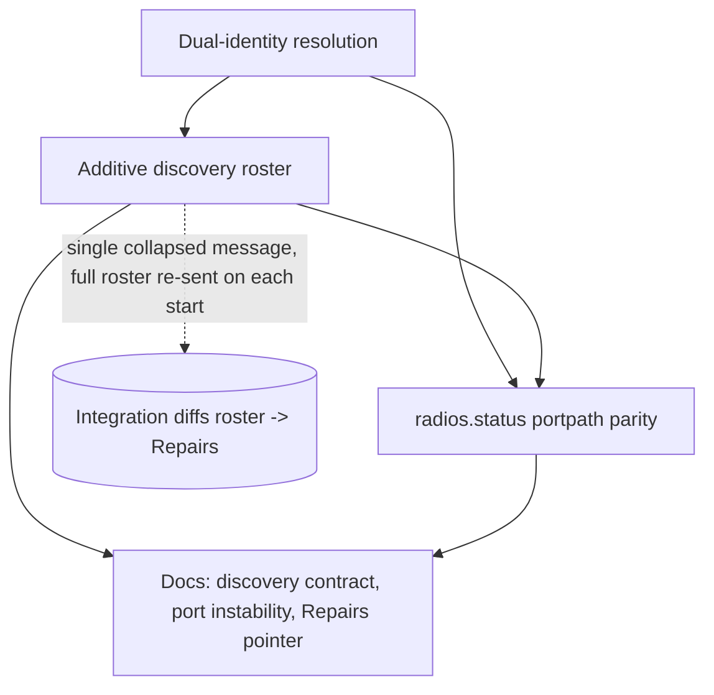
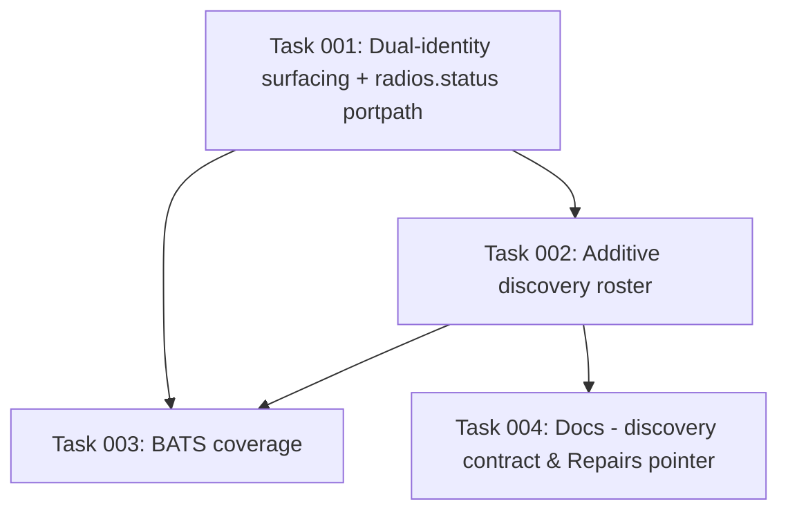

# Plan: Add-on-side support for Repairs-driven radio replacement

## Original Work Order

> An idea for this feature: can reconfiguring with a new radio be integrated
> through Home Assistant's repair feature? Would anything in this PR need to be
> changed to support that from the addon side?
>
> [...] Yes, let's draft the plan. If you need to the companion integration is in
> ../rtl_433.

This plan covers **only the add-on side** of that idea. The Home Assistant
Repairs UI and the hub-rebind/reconfigure flow live in the companion integration
(`../rtl_433`, `custom_components/rtl_433/`), which already has a `repairs.py`,
per-radio config entries keyed by the add-on's `unique_id`, and its own paired
plan (`../rtl_433/RADIO_REPLACEMENT_PLAN.md`). The scope here is what the add-on
must change so that integration can (a) reliably discover **every** radio and
(b) detect a replacement (an old `unique_id` disappears, a new one appears).

## Plan Clarifications

| Question | Answer |
|----------|--------|
| How should the existing integration consumer of the Supervisor discovery payload be treated when the payload shape changes? | **Additive / back-compatible** — emit the new roster fields alongside the existing single-radio fields so an un-updated integration keeps working. |
| How should the integration learn that a radio was replaced? | **On add-on restart** — the replacement procedure already requires stop → replug → start; on start the add-on re-publishes the full current roster and the integration diffs it. No continuous/runtime detection in the add-on. |
| Is backwards compatibility required? | Yes (per the answer above): the change must not break an integration that still reads only the single-radio discovery fields. |
| Does the Supervisor actually collapse multiple discovery messages into one (the design premise)? | **Yes — auto-resolved via Supervisor source** (`home-assistant/supervisor`, `supervisor/discovery/__init__.py`). The `Message` `attrs` class sets `eq=False` on `config` and `uuid`, so message equality is **(app, service) only**; `send()` reuses the existing message and overwrites its `config` when the service matches. Multiple radios therefore collapse to a single `(add-on, rtl_433)` message whose config is the last one published. This confirms the premise and removes the need for a hardware spike or any per-message lifecycle. |
| What emission shape implements the additive roster with provable back-compat? | **Attach the `radios` array to the existing per-radio discovery payload** (keep the current per-radio POST loop unchanged). Because the Supervisor collapses on (app, service), the single surviving message carries the last radio's legacy fields (today's exact behavior, unchanged) plus the full `radios` array. Minimal diff; no behavior change for an un-updated integration. |

## Executive Summary

Plan 08 gave each radio a stable, port-independent identity (`serial:` →
`usbpath:` → `template:`) and surfaced it three ways: a per-radio log line, the
`radios.status` file, and the Supervisor discovery payload. That is enough for a
**manual** relink, but not for a guided **Repairs** experience, because the two
machine-readable channels are each insufficient for the integration: the
`radios.status` file lives under `/addon_configs/<slug>/` and is not readable by
Home Assistant Core, and the Supervisor discovery payload carries only a single
radio's connection details — `publish_discovery` itself notes that all radios
collapse into one Supervisor message (`rtl_433/run.sh` ~L1442). The integration,
however, creates one config entry **per radio** from discovery, so in a
multi-radio setup it can only ever auto-discover one of them, and it has no
complete roster to diff against in order to notice that a radio was swapped.

This plan makes the Supervisor discovery payload the single, authoritative,
machine-readable roster the integration consumes. It adds a `radios` array to the
discovery payload — each entry carrying the radio's `unique_id`, assigned
`port`/`path`, and **both** its `serial` and `usbpath` — while preserving the
existing single-radio fields verbatim so an un-updated integration is unaffected.
Because the replacement procedure already stops and restarts the add-on, each
start re-publishes the full current roster, which is exactly the signal the
integration needs to diff old-vs-new and raise its "a new radio was found —
replace the radio on hub X?" repair. Surfacing both identifiers (not just the
chosen one) is what lets the integration correlate a same-USB-port swap.

The approach was chosen because it reuses the discovery channel the integration
already listens on, requires no new transport (no MQTT, no websocket changes),
fits the existing restart-based replacement flow, and stays backwards compatible.
The design premise — that the Supervisor collapses all of an add-on's same-service
discovery messages into one (so a single message re-published on each restart is
the authoritative full state) — has been confirmed directly against the Supervisor
source (see Plan Clarifications and Background), so the work needs no hardware spike
and the roster array can be attached to the existing per-radio payload with a
minimal, provably back-compatible diff.

## Context

### Current State vs Target State

| Current State | Target State | Why? |
|---------------|--------------|------|
| Discovery payload carries one radio's `host`/`port`/`path`/`unique_id`; multiple radios collapse to a single Supervisor message (`run.sh` ~L1442). | Discovery payload additionally carries a `radios` array describing **every** launched radio; the single-radio fields remain for back-compat. | The integration creates one entry per radio and needs the complete set; today only one radio can auto-discover. |
| Each radio advertises **one** identifier (`serial:` *or* `usbpath:`, whichever `resolve_radio_unique_id` selects). | Each roster entry carries **both** the `serial` and the `usbpath`. | The integration must correlate a same-port hardware swap to propose a replacement; it needs the secondary identifier the chosen `unique_id` hides. |
| `radios.status` records `radio`, `unique_id`, `host`, `port`, `serial` (no port path), and lives under `/addon_configs/<slug>/` (not readable by HA Core). | `radios.status` also records `portpath=` (human parity with the roster); it remains a human-facing artifact, not the integration's data source. | Keeps the human-readable file consistent with the new dual-identity model without pretending it is an API. |
| Replacement detection has no add-on-side enabler; the integration cannot tell a swapped radio from a missing one. | On every start the add-on re-publishes the authoritative full roster; the integration diffs it to detect gone/new radios. | A restart already happens in the replacement procedure, so this is a free, sufficient detection signal. |
| Docs describe a manual copy-paste relink and do not state the discovery contract or that ports are unstable keys. | Docs state the discovery-payload contract (cross-repo), warn that `port` (`BASE_PORT + i`) is **not** a stable key, and point "Replacing a radio" at the integration's Repairs flow. | Prevents the integration (or a future maintainer) from keying on `host:port` and keeps both repos' docs aligned. |

### Background

- **Companion integration is mostly ready.** `../rtl_433` already keys config
  entries by the add-on's `unique_id` (`config_flow.py` `async_step_hassio`),
  already has a `repairs.py`, and has a paired plan
  (`../rtl_433/RADIO_REPLACEMENT_PLAN.md`) covering the rebind/reconfigure and
  repairs work. The known integration-side gap is that a discovered entry cannot
  be re-bound to a new `unique_id`; that is the integration's plan to close, not
  this one.
- **Physical constraint is unavoidable.** An EEPROM re-stamp only takes effect
  after a USB power-cycle, so the user flow is inherently stop → replug → start.
  This plan leans into that: restart is the detection trigger.
- **Why not the other channels.** `radios.status` is on a mount the integration
  cannot read; the rtl_433 websocket stream is produced by the upstream binary,
  not `run.sh`, so injecting identity there would require upstream/proxy work
  (out of scope). Discovery is the one channel the integration already consumes.
- **Supervisor de-dup behavior (confirmed).** `publish_discovery` asserts the
  Supervisor de-duplicates on (add-on, service); this was verified against the
  Supervisor source (`home-assistant/supervisor`,
  `supervisor/discovery/__init__.py`): the `Message` `attrs` class marks `config`
  and `uuid` `eq=False`, so message equality is (app, service) only, and `send()`
  reuses the matching message and overwrites its `config`. Consequence: an add-on
  has at most **one** `(add-on, rtl_433)` discovery message; publishing per-radio
  leaves only the last radio visible (so multi-radio auto-discovery is broken
  today), and re-publishing on restart wholesale replaces that single message.
  This is exactly why a self-contained `radios` array in that one message is the
  right vehicle and why no per-message uuid lifecycle is needed — there is only
  ever one message, already cleaned up on zero radios by `remove_discovery_state`.

## Architectural Approach

The work is an additive, back-compatible extension of the existing discovery
publication path plus the identity-resolution helpers, finished with
documentation. No new transport, no new dependency, no change to the per-radio
launch/supervision model. The Supervisor de-dup behavior the design relies on is
already confirmed (see Background), so there is no investigative spike stage.



### Stage 1 — Dual-identity resolution
**Objective**: Expose both stable identifiers per radio so the integration can correlate a same-USB-port replacement.

`resolve_radio_unique_id` chooses one identity (`serial:` then `usbpath:`); the
roster must additionally expose the **other** identifier for each radio so the
integration can recognize "the dongle in port X now reports a different serial."
This is a surfacing change only — the selected `unique_id` semantics are
unchanged. Both raw values (`serial`, `usbpath`) must be made safe for inclusion
in hand-built JSON and in the tab-separated status file (today `serial` is written
raw to `radios.status`); reuse the JSON-safe allowlist sanitization already used
by `resolve_radio_unique_id`/`radio_match_id`. A radio with neither a usable
serial nor a USB port path (a `template:`-identity radio, e.g. an
explicitly-declared SoapySDR/HackRF device) must surface gracefully with both
fields empty rather than erroring. For human parity, `radios.status` gains a
`portpath=` field; `radios.status` remains a human-facing convenience and is
explicitly **not** the integration's data source.

### Stage 2 — Additive discovery roster
**Objective**: Give the integration the complete, machine-readable set of radios on the channel it already consumes, without breaking the current consumer.

Extend the discovery payload so it carries a `radios` array in addition to the
existing single-radio fields. Each array entry describes one launched radio with
its `unique_id`, assigned `port` and `path`, and both its `serial` and `usbpath`
(from Stage 1). **Emission shape (chosen):** keep the existing per-radio POST loop
unchanged and attach the full `radios` array to each radio's payload `config`;
because the Supervisor collapses on (add-on, service), the single surviving message
carries the last radio's legacy `host`/`port`/`path`/`unique_id`/`secure` fields
(today's exact behavior, unchanged) plus the full `radios` array. An un-updated
integration keeps reading the legacy fields and sees no change; an updated
integration reads the array. The payload must remain valid JSON assembled without
`jq` (consistent with the existing hand-built payload), reusing the sanitization
from Stage 1 so device-derived text cannot break the JSON. Because the single
message represents the full current state and is re-published on every start, it
doubles as the replacement-detection signal (restart-driven, per the clarified
decision); no per-message uuid lifecycle or stale-message cleanup is introduced —
the existing single-message save / remove-on-zero-radios behavior
(`save_discovery_uuid` / `remove_discovery_state`) is retained as-is.

### Stage 3 — Tests
**Objective**: Lock the new payload and identity behavior under the project's existing unit-test conventions.

Add BATS coverage (sourcing `main()`-guarded `run.sh`, as
`tests/rtl_433/test_run.bats` already does) for the roster/payload assembly and
the dual-identity surfacing, driving them with a mock multi-radio device set.
Assert the emitted payload is valid JSON, contains the `radios` array with both
identifiers per entry, and still contains the legacy single-radio fields
(back-compat). Follow the existing pure-function/fixture conventions in
`tests/README.md`.

### Stage 4 — Documentation
**Objective**: Make the cross-repo contract explicit and keep both repos aligned.

Document the discovery-payload contract (field names and the `radios` array
shape) so it stays verbatim-aligned with the integration's consumer; warn that
`port` is assigned `BASE_PORT + i` and is therefore **not** a stable key (the
integration must key on `unique_id`); and update the README "Replacing a radio"
section to point at the integration's Repairs flow once it ships. Keep the
add-on and integration replacement procedures in sync.

## Risk Considerations and Mitigation Strategies

<details>
<summary>Integration / Contract Risks</summary>
- **Payload shape drifts from the integration's parser.** A field rename or shape change on one side silently breaks discovery on the other.
    - **Mitigation**: Define the `radios` array as an explicit cross-repo contract documented in both repos with identical field names; cover the exact shape in tests; treat the integration's consumer as the source of truth for naming.
- **Back-compat regression.** Dropping or altering the legacy single-radio fields would break an un-updated integration.
    - **Mitigation**: Per the clarified decision, the legacy fields are preserved verbatim and tested; the array is purely additive.
</details>

<details>
<summary>Technical Risks</summary>
- **Hand-built JSON is malformed** for unusual serials/port paths.
    - **Mitigation**: Reuse the existing JSON-safe allowlist sanitization (Stage 1); assert validity with `jq` in tests across edge-case fixtures (empty/default serials, no-EEPROM/`usbpath`-only dongles, and a `template:`-identity radio with both fields empty).
- **Transient absence read as removal (false positive).** A radio briefly missing on a restart (USB glitch, slow enumeration) is omitted from the roster, which an integration diff could misread as a removal/replacement and surface a spurious repair.
    - **Mitigation**: This is the integration's diff to make conservative, but the add-on contract documents it: the roster is "radios present at this start," not a durable inventory. Recommend (in the contract note) that the integration only proposes a replacement when a *new, unbound* radio appears — not merely when a known one is absent.
</details>

<details>
<summary>Quality / Scope Risks</summary>
- **Scope creep into the integration.** Building any Repairs/reconfigure UI here would duplicate the integration's plan.
    - **Mitigation**: Hard non-goals (below); this plan stops at the add-on's published data and docs.
</details>

## Success Criteria

### Primary Success Criteria
1. The Supervisor discovery payload contains a `radios` array describing **every**
   launched radio, each entry exposing `unique_id`, `port`, `path`, and both
   `serial` and `usbpath`.
2. The legacy single-radio discovery fields remain present and unchanged, so an
   integration that reads only those still behaves exactly as before
   (back-compat verified).
3. `radios.status` includes a `portpath=` field for each radio.
4. Restarting the add-on re-publishes the full current roster in the single
   collapsed discovery message (the restart-driven detection signal), with no
   per-message uuid lifecycle added and the existing remove-on-zero-radios
   behavior retained.
5. BATS tests cover the roster/payload assembly and dual-identity surfacing,
   including a multi-radio case and JSON validity.
6. Documentation states the discovery contract, warns that `port` is not a stable
   key, and points "Replacing a radio" at the integration's Repairs flow.

## Self Validation

After all tasks are complete, an executor should:

1. Run `bats -r tests/` and confirm the new roster/dual-identity tests pass
   alongside the existing suite.
2. Source `run.sh` in a non-`main()` harness, populate a mock multi-radio
   `rtlsdr_devices` set (mixed: a usable serial, a factory-default serial, and a
   no-serial/usbpath-only dongle), invoke the discovery-payload assembly, and pipe
   the result through `jq .` to confirm it is valid JSON.
3. From that same output, assert with `jq` that `radios | length` equals the
   number of mock radios, that every entry has non-null `unique_id`, `port`,
   `serial` (possibly empty string), and `usbpath`, and that the top-level legacy
   fields (`host`/`port`/`path`/`unique_id`) are still present (back-compat).
4. Invoke the status-file writer against the same mock set and grep the resulting
   `radios.status` to confirm each line now carries `portpath=`.
5. Run `python3 tests/config/validate_configs.py` and `pre-commit run
   --all-files` (shellcheck/hadolint/etc.) to confirm no regressions.
6. (Optional, non-gating — maintainer/hardware) On a real Supervisor with ≥2
   dongles, query the Supervisor discovery endpoint and confirm the single
   published `(add-on, rtl_433)` message's config carries the full `radios`
   roster (all dongles), and that an un-updated integration still discovers one
   radio via the legacy fields. This only confirms in situ what the Supervisor
   source already establishes; the implementation does not depend on it.

## Documentation

- `rtl_433/README.md` — extend the "Replacing a radio" section to reference the
  integration's Repairs flow; add the discovery-contract field reference and the
  port-instability warning.
- Cross-repo: keep the contract and the replacement procedure aligned with
  `../rtl_433/RADIO_REPLACEMENT_PLAN.md` and the integration README; field names
  must match the integration's discovery consumer verbatim.
- No `CHANGELOG.md` hand-edits (release-please owns it); accurate Conventional
  Commit messages drive the changelog.

## Resource Requirements

### Development Skills
- Bash (the `run.sh` helpers and their `main()`-guarded structure), JSON
  assembly without `jq`, and the project's BATS testing conventions.
- Working familiarity with the Home Assistant Supervisor discovery API and how
  the companion integration consumes it.

### Technical Infrastructure
- `bats` for unit tests; `jq` for JSON validity assertions in tests; the existing
  pre-commit linters (shellcheck, hadolint, actionlint, check-yaml/json).
- No special hardware is required to implement or test this plan (the Supervisor
  de-dup behavior is already confirmed from source). A Supervisor + two dongles is
  only needed for the optional, non-gating in-situ confirmation in Self Validation.

### External Dependencies
- The companion integration (`../rtl_433`) is the consumer of the discovery
  contract defined here; the contract's field names must be agreed with its
  paired plan. This add-on plan does not depend on the integration's code
  shipping first (back-compat keeps the two decoupled).

## Integration Strategy

The change rides the existing Supervisor discovery channel and is additive, so it
deploys independently of the integration: an un-updated integration ignores the
new `radios` array, while an updated integration reads it to populate all radios
and to diff for replacements on each add-on restart. The `-next` rolling build
picks up the change automatically; the released add-on follows normal
release-please versioning.

## Notes

- **Hard non-goals** (carried from the work order, reaffirmed under YAGNI): no
  Repairs UI or reconfigure/rebind flow here (integration's job, separate repo
  and plan); no continuous/runtime replacement detection and no per-message uuid
  lifecycle/cleanup (restart-driven detection was chosen); no MQTT; no injecting
  identity into rtl_433's own websocket stream; and no serial cloning — a revived
  old dongle must never collide with its replacement.
- The integration-side counterpart still has an open gap (a discovered entry
  cannot currently be re-bound to a new `unique_id`); closing it belongs to
  `../rtl_433/RADIO_REPLACEMENT_PLAN.md`, not this plan.

### Discovery payload contract (data contract)

The Supervisor discovery message published by the add-on is a single
`(add-on, rtl_433)` message. Its `config` object keeps **all existing fields**
unchanged for back-compat and **adds** a `radios` array. Field names must match
the integration's discovery consumer verbatim (`async_step_hassio` in
`../rtl_433/custom_components/rtl_433/config_flow.py`, which reads `host`, `port`,
`path`, `secure`, `unique_id`, `addon`). Indicative shape:

```jsonc
{
  "service": "rtl_433",
  "config": {
    // --- legacy single-radio fields (unchanged; the last-published radio) ---
    "host": "<addon-hostname>",
    "port": 8434,
    "path": "/ws",
    "secure": false,
    "unique_id": "serial:abcd1234",
    // --- NEW: full current roster (one entry per launched radio) ---
    "radios": [
      { "unique_id": "serial:abcd1234", "port": 8433, "path": "/ws",
        "serial": "abcd1234", "usbpath": "1-1.4" },
      { "unique_id": "usbpath:1-1.2", "port": 8434, "path": "/ws",
        "serial": "", "usbpath": "1-1.2" }
    ]
  }
}
```

Contract notes:
- `host` is shared by all radios and stays top-level only; per-entry connection is
  `ws://<host>:<entry.port><entry.path>`.
- Each entry exposes **both** `serial` and `usbpath` (either may be an empty
  string); a `template:`-identity radio has both empty.
- `port` is assigned `BASE_PORT + i` and is **not** a stable key — the integration
  must key on `unique_id`.
- The `radios` array is "radios present at this start," not a durable inventory
  (see the transient-absence risk): the integration should treat a *new, unbound*
  radio as the replacement signal rather than mere absence of a known one.

### Refinement Change Log

- 2026-06-04: Resolved the keystone uncertainty by inspecting Home Assistant
  Supervisor source — confirmed discovery messages collapse on (app, service),
  so the premise holds. Removed the hardware-gated "discovery multiplicity" spike
  stage (renumbered stages 1–4); reframed it as confirmed background. Fixed the
  emission shape to "attach `radios` array to the existing per-radio payload"
  (minimal, provably back-compatible). Verified the contract field names against
  the integration's `async_step_hassio` and added a Discovery payload contract
  subsection. Added JSON-safety of raw `serial`/`usbpath` and the
  `template:`-identity (both-empty) edge case to Stage 1. Replaced the obsolete
  spike risk with a transient-absence false-positive caveat. Downgraded the
  hardware check to an optional, non-gating Self Validation step.

## Execution Blueprint

**Validation Gates:**
- Reference: `/config/hooks/POST_PHASE.md`

### Dependency Diagram



No circular dependencies.

### Phase 1: Identity foundation
**Parallel Tasks:**
- Task 001: Surface both serial and usbpath per radio in run.sh + portpath in radios.status

### Phase 2: Discovery roster
**Parallel Tasks:**
- Task 002: Add additive `radios` roster to the Supervisor discovery payload (depends on: 001)

### Phase 3: Verification & documentation
**Parallel Tasks:**
- Task 003: BATS coverage for the roster and dual-identity surfacing (depends on: 001, 002)
- Task 004: Document the discovery contract, port instability, Repairs pointer (depends on: 002)

### Post-phase Actions

### Execution Summary
- Total Phases: 3
- Total Tasks: 4
