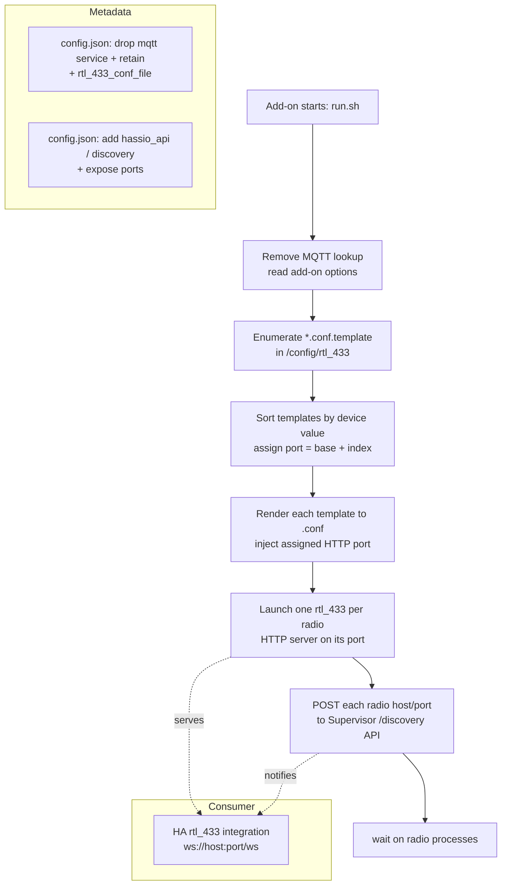
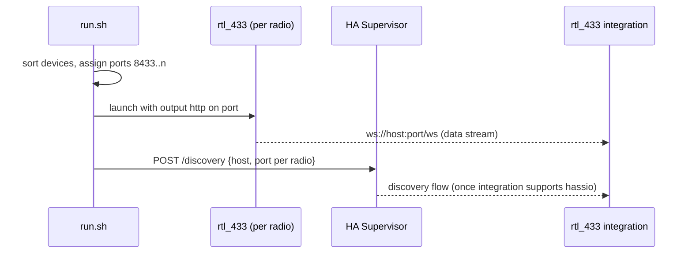
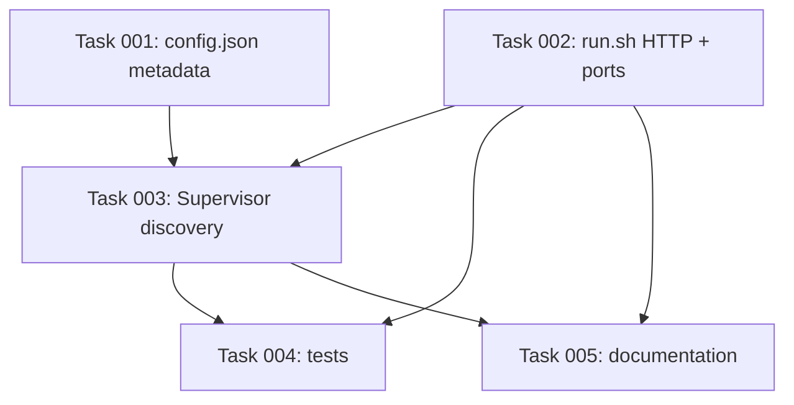

# Plan: Replace MQTT Output with Per-Radio HTTP Servers and Supervisor Discovery

## Original Work Order

> Remove mqtt configuration from the addon. Instead, we should use `output http` to expose the web server. The addon will still need to support multiple radios. Let's support up to 10. The http port will need to be dynamic based on how many radios are running. As well, the radios will need to be set up with stable `device` values in their configuration so that the same radio is always bound to the same port for the home assistant integration. As well, the addon should automatically trigger discovery to set up new radios.
>
> The HA addon is new and available at https://github.com/rtl-433-hass/rtl_433. It is different than the autodiscovery script which we are no longer using.

## Plan Clarifications

| Question | Answer |
|----------|--------|
| The HA integration has no Supervisor (`hassio`) discovery support today — how should the add-on "automatically trigger discovery"? | **Build the add-on side now.** Publish each radio's host/port to the Supervisor `/discovery` API (best-effort; full effect depends on the integration adding matching support later). |
| How aggressively should the MQTT/config be cleaned up (backwards compatibility)? | **Full clean break.** Remove the `mqtt` service dependency, the `retain` option, and the legacy `rtl_433_conf_file` option. No migration shim. |
| How should each radio's stable HTTP port be assigned? | **Base port + sorted index.** Sort templates by their `device` value and assign `8433, 8434, …` (up to `8442` for 10 radios). |
| Which add-ons and tests are in scope? | **Both `rtl_433` and `rtl_433-next`.** Remove the obsolete `tests/rtl_433_mqtt_autodiscovery` tests and the MQTT-specific cases in `tests/rtl_433`. |

## Executive Summary

The `rtl_433` add-on currently fetches MQTT broker credentials from the Home Assistant Mosquitto service and injects an `output mqtt://…` line into each radio's generated configuration. This plan removes that MQTT coupling entirely and instead exposes each radio through rtl_433's built-in HTTP/WebSocket API server (`output http`), which the new Home Assistant rtl_433 integration consumes over `ws://host:<port>/ws`.

Because rtl_433 runs one process per radio and each HTTP server must bind a distinct port, the add-on will deterministically assign ports starting at a base of `8433`, ordered by each radio's `device` value, so the same physical radio is always reachable at the same port. Supporting up to ten radios yields the port range `8433`–`8442`. After launching the radios, the add-on publishes each radio's connection details to the Home Assistant Supervisor discovery API so the integration can offer to configure newly-seen radios automatically.

This is an intentional breaking change: MQTT configuration, the `retain` option, and the deprecated single-file `rtl_433_conf_file` path are removed. Both the stable `rtl_433` add-on and the `rtl_433-next` development variant are updated together, and the obsolete MQTT autodiscovery tests are removed.

## Context

### Current State vs Target State

| Current State | Target State | Why? |
|---------------|--------------|------|
| `run.sh` reads MQTT host/user/pass/port from the `mqtt` service via `bashio::services` | No MQTT service lookup; radios expose an HTTP/WebSocket API | The integration now ingests data over rtl_433's HTTP API, not MQTT |
| Default template emits `output mqtt://…` with `${host}/${port}/…` substitution | Default template emits `output http` bound to an assigned port | HTTP is the new transport the integration expects (`ws://host:port/ws`) |
| `config.json` declares `"services": ["mqtt:want"]` and a `retain` option | `mqtt` service and `retain` option removed; Supervisor discovery permissions added | MQTT is no longer used; the add-on must reach the Supervisor discovery API |
| Each radio's HTTP port is undefined (no HTTP server) | Each radio gets a stable port from `base + sorted-device index` (8433–8442, max 10) | The integration must always find the same radio at the same port |
| Legacy `rtl_433_conf_file` single-file mode supported with a deprecation warning | `rtl_433_conf_file` option removed | Clean break; multi-radio template flow is the only supported path |
| No discovery is triggered; user configures the integration manually | Add-on POSTs each radio to the Supervisor `/discovery` API after launch | Fulfils "automatically trigger discovery to set up new radios" |
| `tests/rtl_433` asserts MQTT settings/retain; `tests/rtl_433_mqtt_autodiscovery` tests an unused script | MQTT-specific tests removed; new tests cover port assignment, template rendering, and discovery payload | Tests must reflect the HTTP-based design |

### Background

- rtl_433's HTTP output is documented as `-F http[:[//]bind[:port]]` with a default bind of `0.0.0.0:8433`; the web UI/API live at `http://host:8433/` and the integration connects to the WebSocket path `/ws`. In a config file this is expressed as an `output http://<bind>:<port>` line.
- rtl_433 selects a physical dongle with the `device` setting: an index (`device 0`), a serial prefixed with a colon (`device :SERIAL`), or a SoapySDR driver string. The `device` line must appear before output lines in the configuration.
- The add-on already runs one rtl_433 process per `*.conf.template` file in `/config/rtl_433`, rendering each template through a bash heredoc that substitutes environment variables. This per-radio process model maps naturally onto one HTTP server per radio.
- The Home Assistant rtl_433 integration (`github.com/rtl-433-hass/rtl_433`, manifest version 0.8.0, `iot_class: local_push`, `config_flow: true`) connects over WebSocket with configurable `host`, `port` (default 8433), `path` (default `/ws`), and a `secure` toggle. Its `config_flow.py` does **not** currently implement `async_step_hassio`, and its manifest declares no `hassio`/discovery source. The add-on's discovery publication is therefore correct-by-construction but only takes full effect once the integration adds matching Supervisor discovery handling.
- Both `rtl_433/config.json` and `rtl_433-next/config.json` mirror the same option/schema/service set and must be changed in lockstep. The `-next` variant is built automatically from `main`.

## Architectural Approach

The change has four cooperating components: stripping MQTT from the entrypoint and metadata, generating a stable device-to-port assignment, switching the default template and per-radio rendering to HTTP output, and publishing each launched radio to the Supervisor discovery API. The entrypoint orchestrates the flow; metadata changes grant the necessary permissions and remove dead options; tests and documentation are updated to match.

### Component 1 — Entrypoint MQTT Removal and Option Surface

**Objective**: Eliminate all MQTT coupling from `run.sh` and the add-on option surface so the add-on neither depends on an MQTT broker nor exposes MQTT-related settings.

Remove the `bashio::services "mqtt" …` block, the `retain` handling, and the deprecated `rtl_433_conf_file` single-file branch from `run.sh`. In both `config.json` files, drop `"services": ["mqtt:want"]`, remove the `retain` and `rtl_433_conf_file` options and their schema entries, and add the permissions and port exposure the new design needs (Supervisor discovery access and the published HTTP port range). The default template generation must no longer reference MQTT variables. This is a clean break with no compatibility shim, consistent with the confirmed decision.

### Component 2 — Stable Device-to-Port Assignment

**Objective**: Guarantee that each physical radio is always reachable on the same HTTP port across restarts, capped at ten radios.

The entrypoint enumerates the rendered radio set, reads each template's `device` value, sorts the set by that value, and assigns ports sequentially from a base of `8433` (`8433` for the first device, `8434` for the second, and so on up to `8442`). The assignment is deterministic for a given set of devices: the same devices always sort the same way and therefore receive the same ports. The add-on must enforce the maximum of ten radios and emit a clear log message if more templates are present than supported. Each radio's `device` line and the computed port are made available to the template rendering step so the generated `output http` line binds the correct port.

### Component 3 — HTTP Output Template and Rendering

**Objective**: Replace MQTT output with rtl_433 HTTP output in both the auto-generated default template and the per-radio rendering pipeline.

The default template created on first run must contain a `device` line and an `output http` line bound to the assigned port (supplied via the existing environment-variable substitution mechanism), retaining the existing helpful defaults (meta reporting, TPMS protocol exclusions) but with all MQTT lines removed. The per-radio rendering loop continues to source each template through the heredoc mechanism, now substituting the assigned port (and confirming the device value) so each rendered `.conf` launches an HTTP server on its dedicated port. The documentation describing minimal configuration is updated to show the HTTP output form rather than the MQTT connection string.

### Component 4 — Supervisor Discovery Publication

**Objective**: After radios are launched, notify Home Assistant so it can offer to set up each radio in the integration without manual entry.

Following process launch, the entrypoint publishes one discovery message per radio to the Supervisor discovery API (reachable from within the add-on using the Supervisor token), carrying the connection details the integration needs (the add-on's host reachable by Home Assistant and each radio's assigned port, with the WebSocket path/secure defaults the integration expects). The `config.json` must grant the add-on the corresponding Supervisor API permission and declare the discovery service. This publication is best-effort: failures to publish must be logged but must not prevent the radios from running, and the design must tolerate the integration not yet consuming the discovery source.

## Risk Considerations and Mitigation Strategies

Technical Risks

- **Integration lacks Supervisor discovery support today**: The published discovery messages will not trigger a config flow until the separate integration repo implements `async_step_hassio`/declares the discovery source.
    - **Mitigation**: Treat discovery as best-effort, log clearly, and document that the HTTP servers are fully usable via manual integration setup in the meantime. The add-on side is built to the standard Supervisor discovery contract so it works as soon as the integration catches up.
- **Port stability breaks when the device set changes**: With base+sorted-index assignment, adding or removing a radio can shift the ports of others.
    - **Mitigation**: Document the chosen trade-off (stable for a fixed device set), log the device→port mapping on every start so changes are visible, and sort by the stable `device` value rather than filename so ordering is predictable.
- **Templates missing a `device` value**: Sorting and stable assignment rely on each radio declaring `device`.
    - **Mitigation**: The default template includes a `device` line, and the rendering step logs a warning when a template has no explicit `device`, since multiple radios without distinct devices cannot be addressed reliably.

Implementation Risks

- **More than ten templates present**: Exceeding the supported radio count could collide ports or exhaust the range.
    - **Mitigation**: Enforce the ten-radio cap explicitly and emit an actionable log message; do not silently truncate without logging.
- **Breaking existing users' configs**: Users with hand-written MQTT templates will lose MQTT output.
    - **Mitigation**: This is an accepted, confirmed breaking change; document it prominently in the changelog and README migration notes.

## Success Criteria

### Primary Success Criteria
1. Neither `run.sh` nor either `config.json` references MQTT, `retain`, or `rtl_433_conf_file`; the `mqtt` service dependency is gone from both add-ons.
2. A freshly-started add-on with no existing config generates a default template containing a `device` line and an `output http` line, and launches an rtl_433 HTTP server reachable on the assigned port.
3. With multiple templates, each radio is bound to a deterministic port (`8433` + sorted-device index, max ten radios), and the same device set always yields the same mapping across restarts.
4. After launch, the add-on POSTs one discovery message per radio to the Supervisor discovery API, logging success or a non-fatal failure for each.
5. The test suite contains no MQTT-specific assertions and instead covers port assignment, HTTP template rendering, and the discovery payload; all tests and pre-commit hooks pass.

## Self Validation

After all tasks are complete, perform these concrete checks:

1. Run `grep -rin "mqtt\|retain\|rtl_433_conf_file" rtl_433/ rtl_433-next/` and confirm there are no functional references remaining (only changelog/migration notes may mention MQTT).
2. Render the default template logic in isolation (source the relevant section of `run.sh` with a temporary `conf_directory`) and confirm the generated `rtl_433.conf.template` contains both a `device` line and an `output http` line and no `mqtt` line.
3. Create three dummy `*.conf.template` files with distinct `device` values in a temporary config dir, run the port-assignment logic, and confirm ports `8433/8434/8435` are assigned in sorted-device order; re-run and confirm the mapping is identical (stability).
4. Create eleven templates and confirm the add-on logs the ten-radio cap message rather than assigning an eleventh port.
5. Run the bats test suite (`tests/`) and confirm all tests pass with no MQTT references; run `pre-commit run --all-files` and confirm shellcheck/hadolint/check-json all pass.
6. Inspect both `config.json` files and confirm: no `mqtt` service, no `retain`/`rtl_433_conf_file` options, presence of the Supervisor discovery permission and the exposed HTTP port range.

## Documentation

- Update `rtl_433/README.md` (and `rtl_433-next/README.md` if it carries configuration docs) to replace the MQTT connection-string guidance with the `output http` form and to explain the per-radio port assignment and the integration's `ws://host:port/ws` connection.
- Add a `CHANGELOG.md` entry for both add-ons describing the breaking removal of MQTT, `retain`, and `rtl_433_conf_file`, and the new HTTP/discovery behaviour.
- Update `AGENTS.md` only if the add-on option/service surface it describes changes materially; the structure section already matches. The default template's inline comments must be rewritten to describe HTTP output and multi-radio `device`/port behaviour instead of MQTT.

## Resource Requirements

### Development Skills
- Bash scripting (`bashio`, heredoc templating, process management) for `run.sh`.
- Home Assistant add-on configuration (`config.json` services, schema, permissions, discovery) knowledge.
- bats shell testing for the test updates.

### Technical Infrastructure
- rtl_433 with HTTP output support (already built in the Dockerfile).
- Home Assistant Supervisor discovery API (reached via the in-container Supervisor token).
- Existing bats test harness with the mock bashio helpers.

## Integration Strategy

The add-on emits data and discovery in the exact shape the `rtl-433-hass/rtl_433` integration expects (WebSocket on the assigned port at `/ws`; Supervisor discovery carrying host/port). No changes are made to the integration in this plan; the add-on is forward-compatible with the integration adding `async_step_hassio` later.

## Notes

- An unrelated active plan, `01--remove-autodiscovery-addon`, also touches the obsolete MQTT autodiscovery surface; coordinate test removals to avoid conflicts, but this plan independently removes only what its scope requires.
- The exact Supervisor "host" value advertised to Home Assistant (e.g. the add-on hostname reachable by HA) should be resolved during implementation using the Supervisor-provided environment, not hard-coded.

## Execution Blueprint

**Validation Gates:**
- Reference: `/config/hooks/POST_PHASE.md`

### Dependency Diagram

No circular dependencies.

### ✅ Phase 1: Foundation — metadata and entrypoint
**Parallel Tasks:**
- ✔️ Task 001: Update add-on config.json metadata for HTTP + discovery
- ✔️ Task 002: Rewrite run.sh — HTTP output with stable per-radio ports

### ✅ Phase 2: Discovery publication
**Parallel Tasks:**
- ✔️ Task 003: Publish each radio to the Supervisor discovery API (depends on: 001, 002)

### Phase 3: Tests and documentation
**Parallel Tasks:**
- Task 004: Update test suite for HTTP/port/discovery behaviour (depends on: 002, 003)
- Task 005: Update documentation for HTTP output and discovery (depends on: 002, 003)

### Post-phase Actions
Run `pre-commit run --all-files` after each phase that changes tracked files; never advance a phase until its validation gate passes.

### Execution Summary
- Total Phases: 3
- Total Tasks: 5
