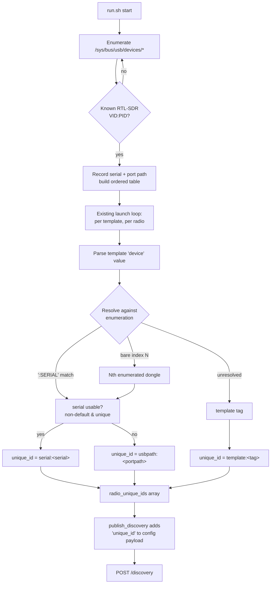
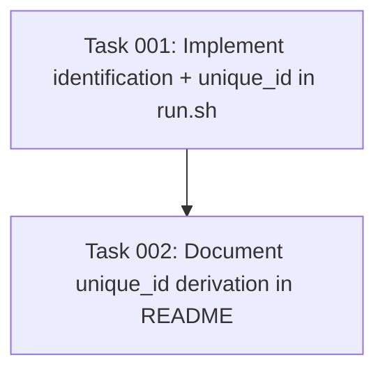

# Plan: Advertise stable per-radio identifiers in Supervisor discovery

## Original Work Order

> Implement automatic radio identification in the rtl_433 Home Assistant add-on — the "Identifying radios (the hard part)" design from MULTI-RADIO-DISCOVERY.md that is NOT yet implemented in main.
>
> Context / current state in main:
> - rtl_433/run.sh launches one rtl_433 process per template, sorts radios by their user-authored `device:` line, and assigns stable HTTP ports starting at BASE_PORT=8433 (up to MAX_RADIOS=10).
> - run.sh `publish_discovery()` POSTs one Supervisor discovery message per radio to http://supervisor/discovery with payload {service:"rtl_433", config:{host, port, path:"/ws", secure:false}}. The payload currently carries NO per-radio identifier/unique_id.
> - The add-on does NO USB/sysfs enumeration; radio identity is left entirely to the user's `device:` line.
> - jq is NOT available in the runtime image (payloads are built with printf).
> - config.json declares discovery:["rtl_433"], hassio_api:true, and a fixed ports range 8433-8442/tcp.
>
> Goal (from MULTI-RADIO-DISCOVERY.md §"Identifying radios" and §"Recommended unique_id strategy"):
> Resolve a stable per-radio identifier IN THE ADD-ON and include it in each discovery `config` payload so the integration can set a stable unique_id. Layered strategy:
>   1. Non-default, unique USB serial → use it (survives moving between ports). Note nearly all RTL-SDR dongles ship with serial 00000001, which collides; reserved values (0/1/2…) collide with the device index.
>   2. Else USB port path (sysfs/udev by-path) → stable unless physically moved; distinguishes identical-serial dongles.
>   3. Optionally surface a user-editable friendly name.
> The add-on reads /sys/bus/usb/devices/*/serial and the port path, decides the identifier, and puts it in the discovery config payload. Also consider the rtl_433 invocation note: `-d :SERIAL` only works if serials are unique; when falling back to port paths, select by index (-d 0, -d 1) and map index→port-path at launch rather than trusting an ambiguous -d :00000001.
>
> Source material: the file MULTI-RADIO-DISCOVERY.md in the repo root (currently untracked) contains the full research, tables, and sources. Read it for detail. Note the integration-side work (async_step_hassio / async_set_unique_id) lives in the separate rtl-433-hass/rtl_433 repo and is OUT OF SCOPE for this add-on repo — scope is limited to the add-on resolving and advertising the identifier.
>
> Follow repo conventions in AGENTS.md (Conventional Commits, shellcheck/hadolint pre-commit hooks, release-please-managed changelog — do NOT hand-edit CHANGELOG or add an [Unreleased] section).

## Plan Clarifications

| Question | Answer |
| --- | --- |
| How should the add-on map each radio to a stable identifier (template-derive vs enumerate)? | Enumerate RTL-SDR dongles from sysfs. (The longer-term goal of replacing user-editable templates with a concatenated base+override config is **explicitly out of scope** here, but the resolver should be a decoupled helper that a future enumeration-driven launch can reuse.) |
| Fallback when no unique serial and no resolvable USB port path? | Use the stable template tag (the config filename already used for logging and port assignment). |
| Payload key carrying the value? | `unique_id` inside the discovery `config` object. |
| Backward compatibility? | Not required. Still keep the change minimal (YAGNI) — do not change radio ordering, port assignment, or the rtl_433 launch/`-d` invocation unless necessary to resolve identity. |

## Executive Summary

Today the rtl_433 add-on publishes one Home Assistant Supervisor discovery message per radio, but the payload carries only `host`/`port`/`path`/`secure`. The consuming integration therefore has no stable per-radio key and can only fall back to host+port, which changes if ports are reassigned. This plan adds a stable hardware-derived identifier to each discovery message.

The add-on will enumerate connected RTL-SDR dongles directly from sysfs (`/sys/bus/usb/devices/*`), reading each device's USB serial and physical port path. For each launched radio it resolves a layered identifier: a non-default, unique USB **serial** when available (survives re-plugging into a different port); otherwise the USB **port path** (stable per physical port, and distinct even when two dongles share the default serial `00000001`); otherwise the stable **template tag** as a last resort for devices that cannot be mapped to a USB RTL-SDR entry (e.g. SoapySDR/HackRF, or an enumeration mismatch). The resolved value is namespaced and emitted as `"unique_id"` in the discovery `config` object.

This approach was chosen because sysfs is already accessible (the add-on declares `usb: true` and `udev: true`), needs no extra packages (no `jq`, no `rtl_test`/`rtl_eeprom` required), and directly implements the layered strategy researched in `MULTI-RADIO-DISCOVERY.md`. The work is intentionally scoped to *resolving and advertising* the identifier; it does not change how radios are ordered, ported, or launched, and it leaves the integration-side `async_set_unique_id` work (a separate repo) untouched.

## Context

### Current State vs Target State

| Current State | Target State | Why? |
| --- | --- | --- |
| Discovery payload is `{host, port, path, secure}` with no per-radio identity. | Discovery payload also includes `"unique_id": "<stable id>"`. | The integration needs a stable key to set `async_set_unique_id` so a radio keeps the same config entry across restarts/port changes. |
| The add-on performs no USB/sysfs enumeration. | The add-on enumerates RTL-SDR dongles from `/sys/bus/usb/devices/*`, capturing serial + port path. | Hardware identity (serial / port path) is the only thing stable across reboots; the device index is not. |
| Radio identity is implicit in the user's `device` line only. | Each launched radio resolves a layered identifier (serial → port path → template tag) decoupled from launch logic. | Implements the documented layered `unique_id` strategy; keeps a future enumeration-driven launch able to reuse the resolver. |
| `rtl_433/README.md` documents discovery without mentioning per-radio identity. | README documents how the identifier is derived and what `unique_id` means for the integration. | Operators need to understand identity stability and how to make it robust (e.g. flashing a unique serial). |

### Background

- The add-on runtime image (`rtl_433/Dockerfile`) installs `libusb`, `hackrf`, `librtlsdr`, `soapy-sdr`, `sed`; `curl` and `bashio` are available from the base image. There is **no `jq`** and **no `rtl_test`/`rtl_eeprom`** CLI, so identity must be read straight from sysfs and payloads must be built with `printf` (as `publish_discovery()` already does).
- `config.json` already sets `usb: true` and `udev: true`, so `/sys/bus/usb/devices/*` (with `idVendor`, `idProduct`, `serial`, and the directory name as the port path) is readable inside the container.
- `run.sh` already maintains parallel arrays (`radio_ports`, `radio_tags`) describing each launched radio and extracts each template's `device` value. The identifier resolution slots into this existing structure: a third parallel array `radio_unique_ids` consumed by `publish_discovery()`.
- RTL-SDR dongles overwhelmingly ship with serial `00000001`; bare reserved values (`0`/`1`/`2`) collide with the device index. A serial is therefore only treated as usable when it is non-empty, not the known default, not a bare reserved integer, **and** unique among the enumerated dongles.
- Mapping rtl_433's device selector to a sysfs entry: a bare index `N` in a template's `device` line maps to the N-th enumerated RTL-SDR dongle (sysfs entries filtered by the known librtlsdr VID/PID table and sorted deterministically by port path to approximate librtlsdr's enumeration order); a `:SERIAL` selector maps to the dongle whose sysfs serial matches; anything else (SoapySDR strings, HackRF, etc.) is unresolved and uses the template-tag fallback.

## Architectural Approach

The implementation is a single, self-contained addition to `rtl_433/run.sh`: a sysfs enumeration helper plus a per-radio resolver, wired into the existing launch loop and consumed by `publish_discovery()`. No new files, packages, or services.

### Component 1: sysfs RTL-SDR enumeration helper

**Objective**: Produce a deterministic, in-memory table of connected RTL-SDR dongles so identity can be resolved without any external CLI.

Add a bash function that scans `/sys/bus/usb/devices/*`, reads `idVendor`/`idProduct`, and keeps only entries whose VID:PID is in the known librtlsdr device table (the same table librtlsdr uses to claim devices — generic Realtek `0bda:2832`/`0bda:2838` plus the documented rebrands). For each match it records the **serial** (contents of the `serial` attribute, empty if absent) and the **port path** (the sysfs device directory name, e.g. `1-1.4`, which is stable per physical USB port). Entries are sorted by port path to give a stable ordering that approximates librtlsdr's index enumeration. The helper tolerates a missing/empty `/sys/bus/usb` (returns an empty table) so local/non-Supervisor runs degrade gracefully, mirroring the best-effort posture of `publish_discovery()`.

### Component 2: per-radio identifier resolver

**Objective**: Map each launched radio to a single, stable, namespaced `unique_id` using the layered strategy.

Add a resolver function that, given a template's `device` value and the enumeration table, returns one identifier string:
1. If `device` is `:SERIAL`, find the enumerated entry with that serial; if `device` is a bare integer index, take that index into the ordered table.
2. From the resolved entry, if its serial is **usable** (non-empty, not the default `00000001`, not a bare reserved integer, and unique within the table) → `serial:<serial>`.
3. Else if a port path is known → `usbpath:<portpath>`.
4. Else (no enumerated match — SoapySDR/HackRF/other, or empty enumeration) → `template:<tag>`.

The resolver is pure (inputs → string) and decoupled from launch, so a future enumeration-driven launch can reuse it. The chosen prefixes (`serial:`/`usbpath:`/`template:`) keep the three identity sources from colliding in the integration's `unique_id` space.

### Component 3: wire into launch loop and discovery payload

**Objective**: Populate identifiers during launch and emit them in discovery without altering existing behavior.

Call the enumeration helper once before the launch loop. Inside the existing per-template loop (alongside `radio_ports`/`radio_tags`), call the resolver and append to a new `radio_unique_ids` array. In `publish_discovery()`, extend the `printf` payload template to include `"unique_id": "%s"` in the `config` object, interpolating the radio's resolved id. Because `unique_id` values come from sysfs/filenames they must be JSON-safe: restrict/escape the emitted value to a conservative character set so the hand-built JSON stays valid (no `jq` available). Port assignment, ordering, and the rtl_433 `-d` invocation are unchanged.

### Component 4: documentation

**Objective**: Explain identity derivation to operators and record the contract for the integration.

Update `rtl_433/README.md` (discovery section) to describe that each radio is advertised with a `unique_id`, how it is derived (serial → port path → template tag), and the practical guidance that flashing a unique serial (`rtl_eeprom -s`, done outside the add-on) gives the most robust identity. Per `AGENTS.md`, do **not** touch `CHANGELOG.md` (release-please owns it) and do not add an `[Unreleased]` section; the Conventional Commit messages will drive the changelog. Note in `MULTI-RADIO-DISCOVERY.md`/AGENTS only if needed — see Documentation section.

## Risk Considerations and Mitigation Strategies

Technical Risks

- **Index→sysfs ordering may not exactly match librtlsdr's enumeration.** Sorting sysfs entries by port path only approximates librtlsdr's internal order, so a bare `device N` could resolve to a different physical dongle than rtl_433 actually opened when multiple identical dongles are present.
    - **Mitigation**: This only affects the *index* path, which is the least-stable selector anyway; serial- and port-path-based identity (the recommended setups) are unaffected. Document that multi-dongle setups should use unique serials or per-port templates. Keep the resolver pure so the mapping can be hardened later (e.g. by parsing rtl_433's own startup log) without touching callers.
- **Hand-built JSON corruption from unexpected characters in serial/port path/tag.** Serials or filenames containing quotes/backslashes could break the `printf` payload since there is no `jq`.
    - **Mitigation**: Sanitize identifier values to a conservative allowlist (alphanumerics, `:`, `-`, `_`, `.`) before interpolation; sysfs serials and port paths are already within this set, and tags are derived from filenames that can be normalized.
- **Missing/empty `/sys/bus/usb` on non-Supervisor or restricted runs.** Enumeration could error and abort the script.
    - **Mitigation**: Treat an absent sysfs tree as an empty enumeration and fall through to the template-tag identifier; never let enumeration failure stop radios from launching (same best-effort contract as `publish_discovery`).

Implementation Risks

- **shellcheck/hadolint pre-commit gate failures.** New bash (arrays, globbing, command substitution) is prone to quoting lint.
    - **Mitigation**: Follow the existing run.sh style (quoted expansions, `mapfile`, explicit glob guards); run `pre-commit run --all-files` before committing.
- **Scope creep toward the enumeration-driven launch / config-restructuring.** The long-term goal could pull this change too far.
    - **Mitigation**: Hard scope boundary — only add the resolver + payload field. The launch loop, port math, and `device` handling are untouched.

## Success Criteria

### Primary Success Criteria
1. `publish_discovery()` emits a valid JSON payload that includes a `"unique_id"` field inside `config` for every launched radio.
2. For a template selecting a dongle with a usable (non-default, unique) serial, the advertised `unique_id` is `serial:<serial>`; for a dongle with the default/duplicate serial, it is `usbpath:<portpath>`; for an unresolvable device, it is `template:<tag>`.
3. The identifier resolver and sysfs enumeration are pure/decoupled bash functions that do not alter existing port assignment, radio ordering, or the rtl_433 launch invocation.
4. `pre-commit run --all-files` passes (shellcheck, hadolint, check-json/yaml).
5. `rtl_433/README.md` documents the `unique_id` derivation; `CHANGELOG.md` is **not** hand-edited.

## Self Validation

After implementation, execute these concrete checks:

1. **Lint gate**: run `pre-commit run --all-files` from the repo root and confirm shellcheck/hadolint pass on the modified `run.sh`.
2. **Syntax + unit-style harness for the resolver**: run `bash -n rtl_433/run.sh` to confirm no syntax errors. Then source/extract the two new functions in a scratch script and exercise the resolver with table-driven inputs, asserting the documented outputs:
   - device `:7858A1` with an enumeration entry serial `7858A1` (unique) → `serial:7858A1`.
   - device `0` with two entries both serial `00000001` at port paths `1-1.2` and `1-1.4` → `usbpath:1-1.2` (index 0), and device `1` → `usbpath:1-1.4`.
   - device `driver=rtl_tcp` (SoapySDR-style, no match) with tag `living_room` → `template:living_room`.
   - empty enumeration (no sysfs) with tag `garage` → `template:garage`.
3. **Mock sysfs enumeration**: build a temporary directory mimicking `/sys/bus/usb/devices/*` (with `idVendor`/`idProduct`/`serial` files for one known RTL-SDR VID:PID and one non-matching VID:PID), point the enumeration helper at it via an overridable base path, and confirm only the RTL-SDR entry is returned with the expected serial and port path.
4. **JSON validity**: capture the exact string `publish_discovery()` would POST for a sample radio (by stubbing `curl`/`host`/arrays) and pipe it through `python3 -c 'import json,sys;json.load(sys.stdin)'` to confirm the hand-built payload — now including `unique_id` — is valid JSON.

## Documentation

- **`rtl_433/README.md`**: add/extend the discovery section to explain the `unique_id` field and its layered derivation, plus the practical note about flashing a unique serial for robust identity.
- **`AGENTS.md`**: no change required unless a new convention is introduced (none is). Do **not** modify `CHANGELOG.md` — release-please generates it from Conventional Commits, and no `[Unreleased]` section should be added.
- **`MULTI-RADIO-DISCOVERY.md`**: optional — the implemented portion (identifier strategy) may be trimmed/annotated as "implemented", but this is not required for the feature and can be handled separately.

## Resource Requirements

### Development Skills
- `bash` scripting (arrays, sysfs reads, `printf`-built JSON, defensive globbing).
- Familiarity with Home Assistant add-on Supervisor discovery and RTL-SDR/libusb device identification.

### Technical Infrastructure
- Existing add-on runtime (`bashio`, `curl`, `sed`, sysfs via `usb`/`udev`). No new packages.
- `pre-commit` (shellcheck, hadolint, check-json/yaml) for the lint gate; `python3` (host/dev only) for JSON validation in self-validation.

## Notes

- The long-term direction (replace the fully user-editable template with a concatenated base+override config, contingent on how rtl_433 handles duplicate config options) is **deliberately excluded** from this plan. The resolver and enumeration helper are written as decoupled, pure functions specifically so that future work can drive them from an enumeration-first launch without rework.
- Integration-side consumption (`async_step_hassio` / `async_set_unique_id`) lives in the separate `rtl-433-hass/rtl_433` repo and is out of scope; this plan only fixes the contract by emitting `unique_id`.

## Execution Blueprint

**Validation Gates:**
- Reference: `.ai/task-manager/config/hooks/POST_PHASE.md`

### ✅ Phase 1: Implementation
**Parallel Tasks:**
- ✔️ Task 001: Implement sysfs enumeration, layered identifier resolver, launch-loop wiring, and `unique_id` discovery payload in `rtl_433/run.sh` (status: completed)

### Phase 2: Documentation
**Parallel Tasks:**
- Task 002: Document the `unique_id` derivation in `rtl_433/README.md` (depends on: 001)

### Post-phase Actions
- After each phase, run the POST_PHASE validation gate (`pre-commit run --all-files`, shellcheck/hadolint, and the task's own validation steps).

### Execution Summary
- Total Phases: 2
- Total Tasks: 2
</content>
</invoke>
