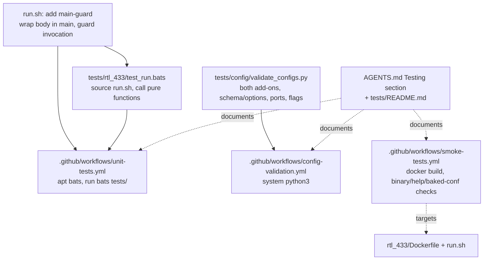
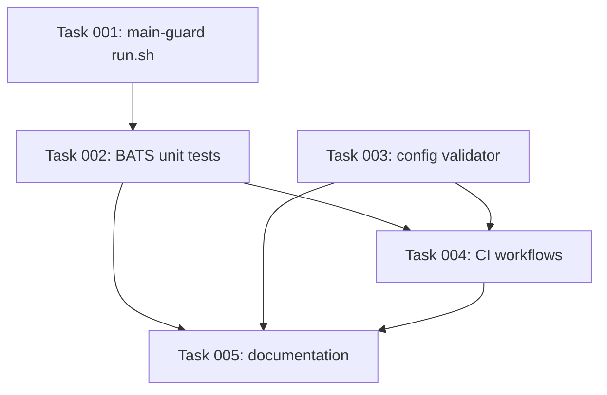

# Plan: Automated Testing Suite for the rtl_433 Add-on (supersede PR #42)

## Original Work Order
> Net: close/supersede #42. Reuse the scaffolding (smoke + config-validation workflows, the validator, CI layout), discard the unit tests + mock wholesale, add the main-guard to run.sh, then write fresh BATS tests against the new functions using the SYSFS_USB_BASE seam.

## Plan Clarifications

| Question | Answer |
| --- | --- |
| Maintain backwards compatibility with PR #42's test files (BATS tests, `mock_bashio.bash`, submodules, `TESTING_PLAN.md`, kcov/Codecov)? | No. They were authored against the old 136-line `run.sh` and never landed on `main`. They are discarded — nothing is ported from them. |
| Does the `main`-guard change `run.sh` runtime behavior? | No. When executed normally the script must behave exactly as today; the guard only prevents the main body from running when the file is *sourced* (for testing). |
| Should the GitHub PR #42 be closed automatically as part of execution? | No. Closing/merging the PR is an outward-facing action left to the maintainer after this branch lands. This plan only produces the superseding work. |

## Executive Summary

This plan adds a small, dependency-light automated test suite for the `rtl_433` Home Assistant add-on and wires it into CI. It supersedes PR #42, whose unit tests were written against a now-replaced `run.sh` (the old MQTT/`.conf.template` design) and which never actually invoked the script under test. The genuinely reusable parts of #42 — a container smoke-test workflow, a config-validation workflow, the Python config validator, and the overall "one small workflow file per concern" CI layout — are brought over and adapted to the current architecture.

The current `run.sh` auto-detects RTL-SDR dongles from sysfs, renders a per-radio config, assigns sequential HTTP ports, and publishes Supervisor discovery. It contains several pure, logic-rich functions (`enumerate_rtlsdr_devices`, `_serial_is_usable`, `resolve_radio_unique_id`, `radio_match_id`) that are exactly the right unit-test targets. The author already left a seam — `SYSFS_USB_BASE` is overridable so enumeration can run against a mock sysfs tree. The one blocker is that `run.sh` executes its main body on load, so it cannot be sourced to obtain just the functions; this plan adds a `main`-guard to fix that without changing runtime behavior.

The outcome is three new CI workflows (unit tests via BATS, container smoke tests, config validation), a fresh BATS test file covering the detection/identifier logic, a maintained config validator, and updated contributor/assistant documentation. No git submodules, no coverage tooling, and no new third-party GitHub Actions are introduced, keeping the suite consistent with the repository's existing lightweight tooling.

## Context

### Current State vs Target State

| Current State | Target State | Why? |
| --- | --- | --- |
| `main` has no automated tests; correctness relies only on lint pre-commit hooks. | `main` has BATS unit tests, container smoke tests, and config validation running in CI on every push/PR. | The maintainer wants better automated testing of the add-on. |
| PR #42's BATS tests target the old 136-line `run.sh` (MQTT service discovery, `retain`, `rtl_433_conf_file`, `.conf.template` heredoc sourcing) — all removed. | Tests target the current 454-line auto-detect architecture and its real functions. | The #42 tests validate features that no longer exist. |
| PR #42's tests never source/exec `run.sh`; they paste copies of old logic into `run bash -c '…'` and assert on the copy. | Tests source the real `run.sh` and call its actual functions. | A test that re-implements the logic it "tests" verifies nothing about the shipped script. |
| `run.sh` runs its main body on load; it cannot be sourced to obtain just its functions. | `run.sh` is `main`-guarded so functions can be sourced without executing the body. | Unit-testing the pure functions requires loading them in isolation. |
| `config.json` `ports` map (8433–8442) and `run.sh` `BASE_PORT`/`MAX_RADIOS` can silently drift apart. | The config validator asserts the ports map and discovery-related flags match expectations. | Ports are now load-bearing and coupled across two files; drift would break discovery silently. |
| PR #42 introduces git submodules (bats-core/support/assert), kcov + Codecov coverage gating, and a pre-commit BATS hook. | None of these are introduced; `bats` is installed from apt in CI only. | Coverage gating on one shell script and submodule/pre-commit friction are disproportionate to the repo's tooling. |
| `AGENTS.md` Testing section says "Rely on pre-commit hooks to run all checks automatically." | Testing section documents how to run the BATS/validator suite. | The statement becomes inaccurate once tests live outside pre-commit. |

### Background

`run.sh` was rewritten after PR #42 was filed (commit `395e1ce` and successors): from a template-sourcing MQTT script to a dongle auto-detection pipeline. The pure functions and the `SYSFS_USB_BASE` override were written with testability in mind but no tests were ever added against them. The maintainer already did one repair pass on #42 (stripping the deleted `rtl_433_mqtt_autodiscovery` add-on), confirming the scaffolding is worth keeping while the unit tests are not.

`rtl_433-next` is a sibling add-on directory containing only `config.json`, `build.json`, `CHANGELOG.md`, and `README.md` (no `Dockerfile`/`run.sh`); the config validator must therefore validate its JSON without assuming add-on source files exist there.

Per `AGENTS.md`, new GitHub Actions must reuse the action references already pinned in the repository. The repo standard for checkout is `actions/checkout@de0fac2e4500dabe0009e67214ff5f5447ce83dd # v6`. There are no existing `setup-python` or `setup-buildx` pins, so the new workflows deliberately avoid them (using the runner's system `python3` and plain `docker build`).

## Architectural Approach

The work is four cohesive pieces: (1) a minimal source-guard refactor of `run.sh`; (2) a fresh BATS test file exercising the detection/identifier functions through the `SYSFS_USB_BASE` seam; (3) a maintained Python config validator; and (4) three small CI workflows plus documentation updates. The old #42 test artifacts are simply not carried over — they do not exist on `main`, so "discarding" them requires no deletions.

### Source-Guard Refactor of `run.sh`
**Objective**: Allow `run.sh` to be sourced so its pure functions load without executing the main body, while preserving identical behavior when the script is executed normally.

The executable top-level statements (reading `disable_tpms`/`log_*` options, `mkdir` of the render dir, the `mapfile` enumeration, the per-device and per-config-file launch loops, the `publish_discovery` call, and the final `wait`/`sleep`) are wrapped in a `main()` function defined after the helper functions. The script ends with a guard that calls `main "$@"` only when the script is executed directly (`[ "${BASH_SOURCE[0]}" = "$0" ]`). Function definitions and bare variable assignments remain at top level (harmless on source; no `bashio` is invoked at top level, so sourcing under plain `bash` without `bashio` is safe). Variables set inside `main()` remain global (no `local`), so the helper and `launch_radio`/`publish_discovery` functions continue to see them exactly as before. The change must pass `shellcheck`/`bash -n` and leave normal container execution unchanged.

### BATS Unit Tests for the Pure Functions
**Objective**: Verify the custom detection and identifier-resolution logic — the real business logic of the script — against the current architecture.

A single `tests/rtl_433/test_run.bats` sources the guarded `run.sh` and exercises:
- `enumerate_rtlsdr_devices` against a mock sysfs tree built under `SYSFS_USB_BASE`: matches known RTL-SDR VID:PID pairs, skips USB interface nodes (`*:*`) and devices lacking `idVendor`/`idProduct`, emits `serial<TAB>portpath`, sorts deterministically, and yields no output (no error) for an empty/missing tree.
- `_serial_is_usable`: rejects empty, the factory placeholders `00000000`/`00000001`, short reserved integers, and serials that are non-unique within the `rtlsdr_devices` array; accepts a genuine unique serial.
- `resolve_radio_unique_id`: the `serial:` → `usbpath:` → `template:` fallback ladder for `:SERIAL` selectors, bare-index selectors, and unmatched selectors, plus JSON-safe sanitisation of the result.
- `radio_match_id`: returns the usable serial when present, else the sanitised port path.

Tests use only plain BATS assertions (`[ … ]`, `$status`, `$output`) — no `bats-assert`/`bats-support`, no submodules, and no `bashio` mock (these functions never call `bashio`). Fixtures are created in `BATS_TEST_TMPDIR` per test. This follows "a few tests, mostly integration": the suite is intentionally small and focused on the script's own logic, not on shell built-ins.

### Config Validator
**Objective**: Catch configuration regressions and cross-file drift for both add-ons without external dependencies.

`tests/config/validate_configs.py` (ported from #42 and adapted) validates `rtl_433` and `rtl_433-next`:
- `config.json` parses and contains the required fields; `arch` includes `aarch64`+`amd64`; `version` is semver or the literal `next`; `image` uses the `ghcr.io/` registry.
- `build.json` parses and contains `build_from` for both architectures.
- `schema` keys and `options` keys are consistent.
- The `ports` map equals the expected `8433`–`8442` range (matching `run.sh` `BASE_PORT=8433`/`MAX_RADIOS=10`), and `discovery` includes `rtl_433`, with `hassio_api`/`usb`/`udev` present — the flags the discovery flow depends on.

The script uses only the Python standard library (no `jsonschema`), exits non-zero on any error, and prints a clear per-add-on report. It must not require a `Dockerfile`/`run.sh` to exist in an add-on directory (so `rtl_433-next` validates).

### CI Workflows and Documentation
**Objective**: Run the suite automatically and keep contributor/assistant docs accurate, consistent with existing CI conventions.

Three new workflow files (one concern each, matching the repo's existing style), all triggered on `push` to `main` and on `pull_request`, all using the repo-standard `actions/checkout@de0fac2e…`:
- `unit-tests.yml`: `apt-get install -y bats`, then `bats tests/`.
- `smoke-tests.yml`: build the `rtl_433` image (`docker build` against the Home Assistant `amd64-base` from `build.json`), then assert `rtl_433` runs (`--help` output token; `-R help` lists protocols), `run.sh` is executable, and the baked-in `/etc/rtl_433/rtl_433.defaults.conf` and `rtl_433.tpms-disables.conf` exist (the latter non-empty with `protocol -` lines) — the artifacts the current architecture depends on.
- `config-validation.yml`: run `python3 tests/config/validate_configs.py` using the runner's system Python.

Documentation: update the `AGENTS.md` "Testing" section to describe the suite and how to run it locally, and add a short `tests/README.md`.

## Risk Considerations and Mitigation Strategies

Technical Risks

- **The `main`-guard inadvertently changes container runtime behavior**: Wrapping the body in `main()` could alter variable scoping or execution order.
    - **Mitigation**: Set no `local` inside `main()` (variables stay global, as today); preserve statement order; verify with `bash -n`, `shellcheck`, and a sourced-vs-executed check (`source run.sh` must define functions without invoking `rtl_433`). The smoke-test job exercises the real image.
- **Sourcing `run.sh` fails without `bashio`/`with-contenv`**: The shebang references `with-contenv bashio`.
    - **Mitigation**: The shebang is a comment when sourced; no `bashio` call exists at top level (all `bashio` use is inside `main()`), so sourcing under plain `bash` defines the pure functions cleanly.
- **Smoke-test image build is heavy (compiles rtl_433 from source)**: Build time/flakiness on CI runners.
    - **Mitigation**: This mirrors the real build and ran in #42; it executes on PR/push where latency is acceptable. No matrix — amd64 only.

Implementation Risks

- **Introducing inconsistent action pins**: New workflows could pull different action versions than the repo standard.
    - **Mitigation**: Use the existing `actions/checkout@de0fac2e…` pin; avoid `setup-python`/`setup-buildx` entirely (system `python3`, plain `docker build`), introducing zero new third-party action references.
- **Validator over-fitting to current config breaks legitimate future changes**: Hard-coding the ports range could be too strict.
    - **Mitigation**: Keep the range check tied to the documented `run.sh` constants and surface a clear error message so an intentional change updates both files together (the drift this is meant to catch).

## Success Criteria

### Primary Success Criteria
1. `run.sh` can be sourced to obtain its functions without executing the main body, and still runs unchanged when executed directly (verified by `bash -n`, `shellcheck`, and a sourced-vs-executed check).
2. `bats tests/` passes locally and in CI, with tests that source the real `run.sh` and assert on `enumerate_rtlsdr_devices`, `_serial_is_usable`, `resolve_radio_unique_id`, and `radio_match_id`.
3. `python3 tests/config/validate_configs.py` exits 0 for the current repository and exits non-zero if the ports map, schema/options, or required fields drift.
4. Three CI workflows (`unit-tests.yml`, `smoke-tests.yml`, `config-validation.yml`) exist, pass `actionlint`, and use the repo-standard checkout pin with no new third-party action references.
5. No git submodules, coverage tooling, or pre-commit BATS hook are added; `AGENTS.md` and `tests/README.md` document the suite.

## Self Validation

After all tasks complete, execute these concrete checks:
1. Run `bash -n rtl_433/run.sh` and `pre-commit run --all-files` — both succeed (shellcheck/hadolint/actionlint/yaml/json all green).
2. Run `bash -c 'source rtl_433/run.sh; type enumerate_rtlsdr_devices _serial_is_usable resolve_radio_unique_id radio_match_id'` and confirm all four are reported as functions and that no `rtl_433`/`mkdir`/`wait` side effects occurred (the main body did not run).
3. Install BATS (`apt-get install -y bats` or equivalent) and run `bats tests/` — confirm all tests pass.
4. Run `python3 tests/config/validate_configs.py` and confirm exit code 0; then temporarily edit a `config.json` ports entry to a wrong value, re-run, and confirm a non-zero exit with a clear error, then revert.
5. Run `actionlint .github/workflows/unit-tests.yml .github/workflows/smoke-tests.yml .github/workflows/config-validation.yml` — no findings.
6. If Docker is available locally, run the smoke-test commands against a freshly built `rtl_433` image to confirm the binary, `run.sh` executability, and the baked-in `.conf` files are present.

## Documentation

- Update the `AGENTS.md` "Testing" section: replace "Rely on pre-commit hooks to run all checks automatically" with a description of the BATS unit tests, the container smoke test, and the config validator, plus the commands to run them locally (`bats tests/`, `python3 tests/config/validate_configs.py`).
- Add a short `tests/README.md` describing the layout (`tests/rtl_433/`, `tests/config/`), how to run each layer, and the `SYSFS_USB_BASE` fixture convention.
- No end-user (README) documentation changes are required; this is contributor/CI-facing only.

## Resource Requirements

### Development Skills
- `bash` scripting (the `main`-guard refactor and BATS tests).
- `bats` / shell unit testing.
- `python` (standard-library config validation).
- `github-actions` / CI workflow authoring.

### Technical Infrastructure
- BATS (installed from apt in CI; locally for development).
- Python 3 standard library (no third-party packages).
- Docker (smoke-test image build on GitHub-hosted `ubuntu` runners).
- Existing repo pre-commit tooling (shellcheck, actionlint, hadolint) for validation.

## Notes
- "Discarding" PR #42's unit tests, `mock_bashio.bash`, bats submodules, `TESTING_PLAN.md`, kcov/Codecov, and the pre-commit BATS hook requires no file deletions on `main` — none of those artifacts were ever merged. They are simply not ported.
- Closing or merging GitHub PR #42 itself is intentionally out of scope for automated execution; it is a maintainer action once this superseding branch lands.

## Execution Blueprint

**Validation Gates:**
- Reference: `/config/hooks/POST_PHASE.md`

### Dependency Diagram

### ✅ Phase 1: Foundations (no dependencies)
**Parallel Tasks:**
- ✔️ Task 001: Add a source-guard (`main`) to `rtl_433/run.sh`
- ✔️ Task 003: Create the add-on config validator `tests/config/validate_configs.py`

### ✅ Phase 2: Unit Tests
**Parallel Tasks:**
- ✔️ Task 002: Write fresh BATS unit tests for the `run.sh` functions (depends on: 001)

### Phase 3: CI Wiring
**Parallel Tasks:**
- Task 004: Add the three CI workflows (depends on: 002, 003)

### Phase 4: Documentation
**Parallel Tasks:**
- Task 005: Update `AGENTS.md` Testing section and add `tests/README.md` (depends on: 002, 003, 004)

### Post-phase Actions
After each phase, run the validation gate in `/config/hooks/POST_PHASE.md` (lint via `pre-commit run --all-files`, and run the relevant tests as they come online).

### Execution Summary
- Total Phases: 4
- Total Tasks: 5
