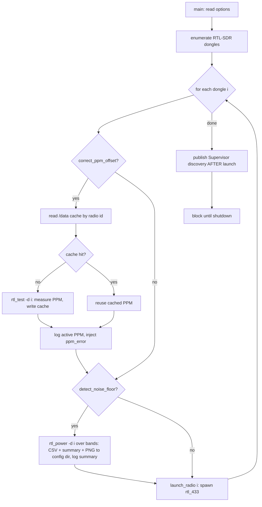
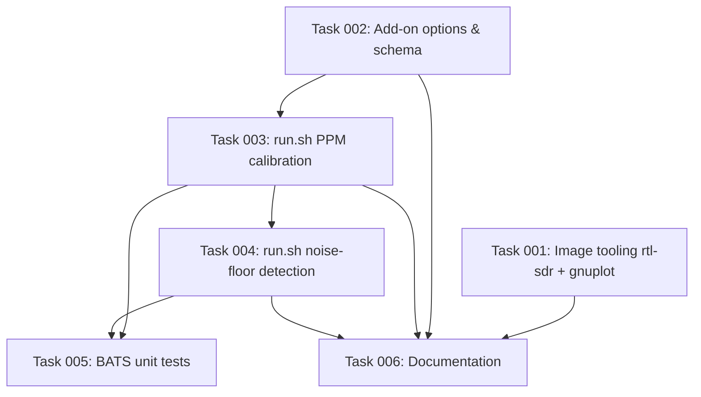

# Plan: Radio Optimization — PPM Calibration & Noise-Floor Detection

## Original Work Order

> I would like to add a way for a user to optimize their rtl_433 radio setup. Two aspects:
>
> 1. I would like a way to automatically correct a radio ppm offset:
>
> > Correct the PPM error. The NESDR Mini 2+ has a TCXO but still drifts a bit. Calibrate with rtl_test -p (let it run several minutes) and then pass the offset, e.g. rtl_433 -f 915M -p <ppm>. A few kHz of offset narrows your effective capture and drops marginal packets.
>
> Is the offset generally static once measured? I'm imagining a toggle in the addon along the lines of "correct offset on startup". Instead of immediately spawning rtl_433 processes, it would run rtl_test and then pass in the offset to -p. Or is there a way we could do it in the integration at https://github.com/rtl-433-hass/rtl_433 ? I'm guessing that would only work if rtl_433 could be told to find the offset instead of using rtl_test.
>
> 2. A "detect noise floor on startup" option that would use rtl_power to find the noise floor and report it. Perhaps even generate a diagram or graph, and save it to the addon config directory? Again, it would be neat from a UX standpoint if this could be done from the integration with a command to rtl_433 to fetch the noise floor.
>
> Note that if this is done in the addon, they would need to be so that radio discovery isn't published until after the rtl_433 processes have started.

## Plan Clarifications

| Question | Answer |
| --- | --- |
| Should this live in the integration / be driven by rtl_433? | No. The integration only consumes decoded events over `ws://…/ws` and (optionally) sends `/cmd` settings; rtl_433 has no PPM auto-calibration and no noise-floor query. Both features must live in the **add-on**, run **before** launching rtl_433 (the tools need exclusive device access). |
| Is the PPM offset static once measured? | Effectively yes — it is a per-dongle crystal property that drifts only slowly. So **measure once, cache the value, reuse it** on every later startup. Re-measure only when the cache is missing or the user deletes the cache file. |
| PPM calibration behavior | Measure once with `rtl_test`, cache, and reuse. Inject the value as an `ppm_error` directive into the radio's rendered config. **Log the active PPM offset on every startup.** |
| Noise-floor output | Run `rtl_power`; save the raw CSV, a human-readable text summary, **and a rendered PNG graph** to the add-on config directory; log a summary line. |
| Noise-floor scan band | The add-on cannot know Home Assistant's runtime-managed frequency at boot, so add a **new add-on option** for the scan band(s), defaulting to `433.92M,868M,915M`. The noise floor is documented as a boot-time snapshot. |
| Storage locations | PPM cache lives in the persistent `/data` volume (state convention). Noise-floor CSV/text/PNG live in the user-visible add-on config directory. |
| Backwards compatibility | Both features are **opt-in and default off**, so existing behavior is unchanged. No BC break intended. |
| PPM measurement duration | Run `rtl_test` for a **fixed ~180s (3 min) constant** per radio on first boot (after the tool's own ~5s warmup), then cache. No extra add-on option. |
| PPM precedence vs a manual override | If a radio's override `<id>.conf` already contains an `ppm_error` directive, **do not run `rtl_test` and do not inject an auto value** for that radio — the user's explicit setting wins — and log that auto-PPM was skipped. |
| Noise-floor report retention | Save **timestamped** filenames (`noise-<id>-<timestamp>.{csv,txt,png}`) so past scans are kept for comparison. The add-on does not prune them; documented as user-managed. |
| Dongle selection for the tools | `rtl_test`/`rtl_power` `-d` accepts an index *or* a serial, so select **by serial when usable** (matching how `run.sh` picks rtl_433's device), falling back to the enumeration index. |

## Executive Summary

This plan adds two opt-in radio-optimization features to the `rtl_433` add-on, both implemented entirely in the add-on (`run.sh` + image build), because neither the Home Assistant integration nor rtl_433 itself can perform them. The first, **PPM offset correction**, runs `rtl_test` once per radio to measure the dongle's crystal frequency error, caches the value in the persistent `/data` volume, and on every startup injects it as an `ppm_error` directive into that radio's rendered config — logging the active offset. Because the offset is effectively static per dongle, only the first boot pays the measurement cost; later boots reuse the cached value, and a user forces a re-measurement simply by deleting the cache file.

The second, **noise-floor detection**, runs `rtl_power` once per radio at boot across a user-configurable set of bands (default `433.92M,868M,915M`), then saves the raw CSV, a text summary (min/median/peak dBm per band), and a rendered PNG spectrum graph into the add-on config directory, plus a one-line log summary. Because Home Assistant manages the runtime frequency over rtl_433's `/cmd` endpoint *after* the add-on boots, the add-on cannot know the live frequency at scan time; the scan band is therefore an explicit option and the result is documented as a boot-time snapshot.

Both features depend on the SDR tools `rtl_test` and `rtl_power` (Alpine's `rtl-sdr` package) and a PNG plotter, which are added to the image. Both tools require exclusive access to a dongle, so the work is sequenced **before** each radio's rtl_433 is launched; Supervisor discovery continues to be published only **after** the rtl_433 processes start, satisfying the work order's ordering requirement.

## Context

### Current State vs Target State

| Current State | Target State | Why? |
| --- | --- | --- |
| Image installs only `librtlsdr` (the library). | Image also installs `rtl-sdr` (`rtl_test`, `rtl_power`) and a PNG plotter. | The optimization features shell out to these tools, which are not currently present. |
| `main()` enumerates dongles and immediately launches rtl_433 per device. | Before launching a device's rtl_433, an optional per-device calibration step runs (PPM measure/reuse, noise scan). | The tools need exclusive device access, which is only possible before rtl_433 grabs the dongle. |
| Each radio's rendered config has no frequency-correction directive. | When PPM correction is on, the rendered config carries an `ppm_error <n>` line. | Applies the measured offset through the existing config-render pipeline (cleaner than CLI `-p`). |
| Add-on has three options (`disable_tpms`, `log_received_messages`, `log_diagnostic_messages`). | Three new options added: `correct_ppm_offset`, `detect_noise_floor`, `noise_floor_bands`. | Exposes the two features (default off) and the scan band the add-on can't otherwise know. |
| No persistent per-radio measurement state. | Per-radio measured PPM cached under `/data`. | Avoids re-running the slow measurement on every boot; offset is effectively static. |
| Nothing is written to the user-visible config directory by the add-on. | Noise-floor CSV/text/PNG written to the add-on config directory. | The work order asks for the report/graph to be saved where the user can see it. |
| Discovery is published after rtl_433 launches. | Unchanged — still published after launch, now also after calibration. | Preserves the work order's ordering requirement. |

### Background

- **rtl_433-next shares source.** CI copies `rtl_433/*` (run.sh, Dockerfile, defaults.conf) into `rtl_433-next/` at build time, but each add-on keeps its own `config.json`. New options must therefore be added to **both** `rtl_433/config.json` and `rtl_433-next/config.json`; `run.sh`/`Dockerfile` are edited only in `rtl_433/`.
- **`rtl_test -p`** estimates the crystal PPM by comparing sample timing against the device clock; it does not require an external signal. After a ~5s warmup it prints a "cumulative PPM" estimate (refreshed roughly every 15s) that converges the longer it runs. *Per clarification, it is run for a fixed ~180s (3 min) per radio and the final cumulative estimate is parsed.*
- **`rtl_power`** performs a power sweep over a frequency range and emits CSV rows (`date, time, Hz low, Hz high, Hz step, samples, dB…`). A single sweep per band yields the noise-floor statistics.
- **Device selection.** `rtl_test`/`rtl_power` accept `-d` with *either* an enumeration index *or* a serial. *Per clarification, the calibration selects by serial when the serial is usable (the same condition `run.sh` already uses to select rtl_433's device with `:serial`), and falls back to the enumeration index otherwise.* The PPM cache is keyed by the stable per-radio identifier (`match_id`) already computed for override-file matching and discovery, so a shifted index never reads a stale cache.
- **`noise_floor_bands` contract.** A comma-separated list of center frequencies (e.g. `433.92M,868M,915M`). Each entry is expanded by the add-on into a fixed-width sweep window with a fixed bin size for `rtl_power`; malformed entries are skipped with a warning.
- **Why not the integration / rtl_433.** Confirmed against the integration and rtl_433 docs: the integration consumes decoded events (and can send `/cmd` setting changes), and rtl_433 exposes no calibration or noise-floor command. Driving either feature remotely would require upstream rtl_433 work that is out of scope.

## Architectural Approach

The work is layered onto the existing `run.sh` enumerate-then-launch flow as an optional per-device pre-launch stage, plus image and config additions. All new logic is factored into small pure helpers (consistent with the existing `main()`-guarded, BATS-tested helper style) so the parsing and caching can be unit-tested without hardware.

### Image Tooling
**Objective**: Make `rtl_test`, `rtl_power`, and PNG rendering available in the runtime image.

Add Alpine's `rtl-sdr` package (provides `rtl_test` and `rtl_power`) and a lightweight PNG plotter (e.g. `gnuplot`) to the final-stage `apk add` in `rtl_433/Dockerfile`, following the existing unpinned-version convention and `hadolint` ignores already in the file. The smoke-test workflow gains assertions that the new binaries exist, mirroring the existing `which rtl_433` check, so a missing tool fails CI rather than failing silently at runtime.

### Add-on Options & Schema
**Objective**: Expose the two features and the scan band, defaulting to no behavior change.

Add to both `config.json` files (and their `options`/`schema` blocks):
- `correct_ppm_offset` — `bool`, default `false`.
- `detect_noise_floor` — `bool`, default `false`.
- `noise_floor_bands` — `str`, default `"433.92M,868M,915M"` (used only when `detect_noise_floor` is on).

`tests/config/validate_configs.py` is extended so the new options/schema keys are part of the validated invariants for both add-ons.

### PPM Calibration
**Objective**: Measure each dongle's PPM offset once, cache it, reuse it, and apply it.

When `correct_ppm_offset` is on, for each enumerated dongle before launch:
1. **Respect a manual override first.** *Per clarification:* if that radio's override `<id>.conf` already contains an `ppm_error` directive, skip `rtl_test` entirely, inject nothing (the user's value flows through the normal override append and wins), and log that auto-PPM was skipped because a manual value is present.
2. Otherwise resolve the cache path under `/data` keyed by the radio's stable identifier; if a cached value exists, reuse it; if not, run `rtl_test` (selecting the dongle by serial when usable, else index) for the fixed ~180s window, parse the final cumulative-PPM estimate, and persist it (value plus a measurement timestamp so the log can report when it was taken).
3. Inject the resolved value into the radio's rendered config as an `ppm_error <n>` directive (extending `launch_radio`'s config assembly, alongside the existing `output kv`/`output log` injection), and log the active offset on every startup (e.g. `Radio <id>: PPM offset <n> (measured <date> / cached)`).

A missing/empty/unparseable measurement is non-fatal: it is logged and the radio launches without correction. Re-measurement is triggered by deleting the cache file (documented), so no extra option is needed.

New pure helpers (BATS-tested): parse the PPM value from `rtl_test` output; read/write the per-radio PPM cache; and detect whether an override file already declares `ppm_error` (the skip-if-manual check). `/data` is overridable via the existing `DATA_DIR` test seam.

### Noise-Floor Detection
**Objective**: Produce a saved, human-readable noise-floor report and graph per radio at boot.

*Per clarification, the scan runs on **every boot while the option is on*** (no run-once sentinel and no self-modifying config — see the Decision Log). When `detect_noise_floor` is on, for each enumerated dongle before launch: parse `noise_floor_bands` into band sweep ranges, run `rtl_power` once per band against that dongle (selected by serial when usable, else index), write the raw CSV and a text summary (min/median/peak dBm) to the add-on config directory, render a PNG spectrum graph with the plotter, and log a one-line summary per band. *Per clarification, files use timestamped names* (`noise-<id>-<timestamp>.{csv,txt,png}`) keyed by the stable radio identifier, so multi-radio setups don't collide and past scans are retained; the add-on does not prune them (documented as user-managed). All steps are best-effort and non-fatal — a tool or write failure is logged and the radio still launches.

New pure helpers (BATS-tested): parse `noise_floor_bands` into validated sweep arguments, and compute min/median/peak statistics from `rtl_power` CSV rows.

### Startup Sequencing
**Objective**: Run the exclusive-access tools before rtl_433 and keep discovery after launch.

The calibration/noise steps are inserted into the existing per-dongle enumeration loop in `main()`, immediately before each `launch_radio` call, so each tool runs while the dongle is still free and only that dongle is touched. The explicitly-declared-radio loop, the `publish_discovery` call, and the blocking `wait` are unchanged — discovery still fires only after all rtl_433 processes are launched. Because measurement is serial per dongle and (for PPM) only happens on first boot, the steady-state startup cost is negligible; the first-boot/noise-scan cost is documented.

## Risk Considerations and Mitigation Strategies

Technical Risks

- **Exclusive device access**: `rtl_test`/`rtl_power` cannot run while rtl_433 holds the dongle.
    - **Mitigation**: Run them in the enumeration loop strictly before that dongle's `launch_radio`; operate one dongle at a time.
- **Enumeration index vs stable identity**: a dongle's `-d` index can shift between boots, risking a stale cache read.
    - **Mitigation**: Key the PPM cache and report filenames on the existing stable `match_id`, not the index; measure/scan within the same loop iteration that resolved the index.
- **Measurement accuracy vs duration**: too short a `rtl_test` run gives a noisy PPM estimate.
    - **Mitigation**: Use a fixed ~180s (3 min) sampling window after the tool's own warmup; document that the cached value can be deleted to re-measure.
- **Boot-time vs runtime frequency mismatch**: the noise floor is scanned at the configured band, not Home Assistant's live `/cmd`-managed frequency.
    - **Mitigation**: Expose the scan band as an explicit option and document the result as a boot-time snapshot.
- **Image size / build**: adding `rtl-sdr` and a PNG plotter increases image size.
    - **Mitigation**: Use Alpine packages already available; smoke-test the binaries so build regressions are caught.
- **Serial-as-`-d` version dependency**: passing a serial to `rtl_test`/`rtl_power` `-d` relies on the rtl-sdr version supporting serial device search.
    - **Mitigation**: Prefer serial when usable but fall back to the enumeration index; the smoke test/CI catches a tool that rejects the form, and the index path always works.
- **Noise-report accumulation**: scanning on every boot while the option is on, with timestamped filenames, means report files accumulate in the config directory and are never pruned by the add-on.
    - **Mitigation**: Documented as user-managed (the user disables the option once satisfied and deletes old files); keep filenames clearly namespaced (`noise-<id>-<timestamp>`) so they are easy to find and bulk-delete.

Implementation Risks

- **Tool failure aborting startup**: a measurement or write error must never stop radios from running.
    - **Mitigation**: Treat every optimization step as best-effort — log and continue to `launch_radio`, matching the existing best-effort discovery pattern.
- **Config-schema drift between the two add-ons**: options added to one `config.json` but not the other.
    - **Mitigation**: Add the options to both files and assert them in `validate_configs.py`.
- **Writing to the config directory**: the add-on currently never writes there; permissions/coexistence with user override files.
    - **Mitigation**: Use a distinct per-radio report filename namespace and the existing `addon_config:rw` map; never touch user `<id>.conf` files.

## Success Criteria

### Primary Success Criteria
1. With both options off, the add-on's startup behavior, rendered configs, and discovery are byte-for-byte unchanged from today.
2. With `correct_ppm_offset` on, the first boot measures (~180s) and caches a per-radio PPM value under `/data`, later boots reuse it without re-measuring, the rendered config contains a matching `ppm_error` line, and the active offset is logged each startup; deleting the cache file forces a fresh measurement. When the radio's override already declares `ppm_error`, `rtl_test` is skipped and the manual value is preserved.
3. With `detect_noise_floor` on, each radio produces a timestamped CSV, text summary, and PNG graph in the add-on config directory for each configured band on every boot, plus a log summary, without preventing the radios from launching.
4. `rtl_test`, `rtl_power`, and the PNG plotter are present in the built image (asserted by the smoke test).
5. Supervisor discovery is published only after the rtl_433 processes are launched.
6. New BATS unit tests cover the PPM-parse, cache read/write, band-parse, and CSV-statistics helpers; `validate_configs.py` validates the new options on both add-ons; `pre-commit run --all-files` passes.

## Self Validation

After implementation, perform these concrete checks:

1. **Binaries present**: build the image (`docker build --build-arg BUILD_FROM=ghcr.io/home-assistant/amd64-base:3.21 -t rtl_433-test ./rtl_433`) and run `docker run --rm rtl_433-test which rtl_test rtl_power gnuplot` — all three must resolve.
2. **Helper unit tests**: run `bats -r tests/` and confirm the new PPM-parse, cache, band-parse, and CSV-statistics tests pass (feed recorded `rtl_test`/`rtl_power` sample output as fixtures).
3. **PPM injection (sourced run.sh)**: source `run.sh` with `DATA_DIR` pointed at a temp dir seeded with a cached PPM value for a mock radio id, render that radio's config, and grep the rendered file for the expected `ppm_error <n>` line; confirm the startup log line reports the same offset.
4. **No-cache path**: with the cache dir empty, confirm the measure helper writes the cache file and that a second render reuses it (no second measurement invoked).
5. **Manual-override precedence**: with an override `<id>.conf` containing `ppm_error`, confirm the skip-if-manual helper reports "manual present", no auto value is injected, the manual value survives in the rendered config, and the skip is logged.
6. **Noise-floor outputs**: drive the noise helpers against a sample `rtl_power` CSV fixture and confirm a timestamped `.csv`, a `.txt` summary with min/median/peak values, and a `.png` are produced under a temp config dir, and that a per-band summary line is logged.
7. **Config validation**: run `python3 tests/config/validate_configs.py` and confirm both add-ons pass with the three new options present in `options` and `schema`.
8. **Defaults-off regression**: render a radio config with all new options off and diff it against the current output to confirm no change.
9. **Lint**: run `pre-commit run --all-files` (shellcheck, hadolint, actionlint, check-json/yaml) and confirm it passes.

## Documentation

- **`rtl_433/README.md`**: document the two new options and `noise_floor_bands` (comma-separated center frequencies); explain that PPM is measured once (~3 min) and cached (delete the cache file to re-measure), that a manually-set `ppm_error` in an override is respected and suppresses auto-measurement, that the active offset is logged on startup, that the noise scan runs **on every boot while the option is on** (so the user disables it when satisfied) and writes **timestamped** CSV/text/PNG files to the config dir that the add-on never prunes, that the noise floor is a boot-time snapshot at the configured band (not Home Assistant's runtime-managed frequency), and the first-boot/noise-scan startup-delay implication.
- **`rtl_433-next/README.md`**: mirror the relevant additions as appropriate for the rolling build.
- **`AGENTS.md` (Structure section)**: note the new add-on options, that `rtl_test`/`rtl_power`/the PNG plotter are now part of the image, and that the per-radio PPM cache lives under `/data`.
- **`CHANGELOG.md`**: not hand-edited — accurate Conventional Commit messages drive the release-please changelog (per repo policy).

## Resource Requirements

### Development Skills
- Bash scripting within the existing `main()`-guarded, helper-factored `run.sh` style.
- Familiarity with `rtl_test`/`rtl_power` output formats and rtl_433 config directives (`ppm_error`).
- Alpine/`apk` Dockerfile editing and `gnuplot` (or equivalent) plotting.
- BATS test authoring following `tests/` conventions and Python for `validate_configs.py`.

### Technical Infrastructure
- Alpine `rtl-sdr` package and a PNG plotter in the image.
- Persistent `/data` volume (already present) for the PPM cache; the `addon_config:rw` map (already present) for reports.
- Existing CI: smoke tests, addon-linter, BATS, config validation, pre-commit.

## Notes

- The `ppm_error` directive is preferred over CLI `-p` so correction flows through the existing config-render pipeline and remains visible in the rendered config.
- Per-radio measurement is serial and, for PPM, only occurs on first boot; the steady-state startup cost is negligible.
- No mechanism is added to feed these results to the integration/rtl_433 over the wire — confirmed out of scope, as neither supports it.

### Decision Log
- **Noise scan is not a self-disabling one-shot.** Self-modifying the add-on's own options was investigated (`POST /addons/<slug>/options`; there is no `self` form) and rejected: it requires an elevated `hassio_role`, rewrites user config, and is a fragile pattern. A `/data` run-once sentinel was offered as a clean alternative; the chosen behavior is the simplest — **scan on every boot while `detect_noise_floor` is on**, with the user disabling it manually when satisfied. Timestamped report filenames keep each boot's scan.
- **PPM is applied via the `ppm_error` config directive**, measured once for ~180s and cached in `/data`; a manually-set `ppm_error` in an override takes precedence and suppresses auto-measurement.
- **Dongle selection for the tools is by serial when usable, else index** (both `rtl_test` and `rtl_power` accept either on `-d`).

### Change Log
- 2026-06-02: Refinement session. Fixed PPM measurement at ~180s (no new option); added skip-if-manual `ppm_error` precedence; switched noise reports to timestamped filenames scanned every boot; documented dongle selection by serial/index; investigated and rejected add-on self-modifying its options; added corresponding risks, success criteria, validation steps, and this Decision Log.

## Execution Blueprint

**Validation Gates:**
- Reference: `.ai/task-manager/config/hooks/POST_PHASE.md`

### Dependency Diagram

No circular dependencies; every task is in exactly one phase.

### Phase 1: Independent foundations
**Parallel Tasks:**
- Task 001: Add rtl-sdr and gnuplot to the image and smoke-test them
- Task 002: Add the three new add-on options to both config.json files and validate them

### Phase 2: PPM calibration in run.sh
**Parallel Tasks:**
- Task 003: Implement PPM offset calibration in run.sh (depends on: 002)

### Phase 3: Noise-floor detection in run.sh
**Parallel Tasks:**
- Task 004: Implement noise-floor detection in run.sh (depends on: 003)

### Phase 4: Tests and documentation
**Parallel Tasks:**
- Task 005: BATS unit tests for the new run.sh helpers (depends on: 003, 004)
- Task 006: Document the PPM and noise-floor features (depends on: 001, 002, 003, 004)

### Post-phase Actions
After each phase, run the POST_PHASE validation gate (lint + tests as applicable) before transitioning.

### Execution Summary
- Total Phases: 4
- Total Tasks: 6
