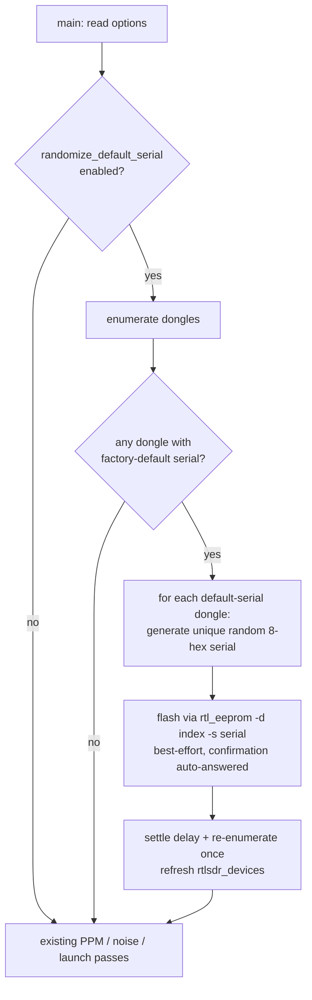
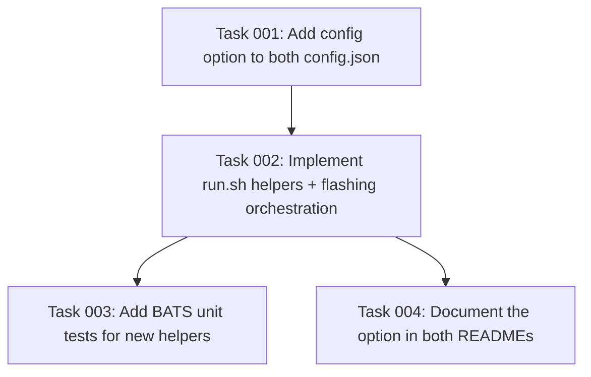

# Plan: Randomize Factory-Default RTL-SDR Serials at Startup

## Original Work Order
> Add an option to create a new, random serial number if the serial number is the default rtl radio serial number during startup.

## Plan Clarifications

| Question | Answer |
| --- | --- |
| After `rtl_eeprom` flashes a new serial, the dongle must re-enumerate before the new serial is visible. How should the add-on handle this within a single startup? | Flash all default-serial dongles up front, attempt a best-effort device reset, re-run enumeration once, then proceed with whatever serials are now visible. |
| What format should the generated random serial use? | 8 random hex characters (the common RTL-SDR serial style). |
| When several connected dongles all carry the same default serial, what should the option do? | Flash each a distinct random serial so they all become individually identifiable. |
| Should this be strictly additive with no backwards-compatibility concerns? | Yes — a new boolean option defaulting to `false`; existing installs are unaffected unless explicitly enabled. |

## Executive Summary

Nearly all RTL-SDR dongles ship with the same factory-default serial (`00000000` or `00000001`), which makes multiple dongles indistinguishable and forces the add-on to fall back to the less-convenient USB-port-path identity. The add-on already recognises these placeholders as unusable (`_serial_is_usable`), and the image already bundles `rtl_eeprom` (from the `rtl-sdr` package). Today, flashing a unique serial is a manual, out-of-band step documented in the README.

This plan adds a new, opt-in add-on option (`randomize_default_serial`, off by default) that automates that step. Early in startup — after dongles are enumerated but before any process claims a device — the add-on flashes a unique, random 8-hex-character serial onto every dongle that still carries a factory-default serial, then performs one re-enumeration so the freshly assigned serials are used for the rest of the boot (identity resolution, PPM measurement, noise-floor scans, and per-radio launch). Because a flashed dongle no longer has a default serial, the operation is naturally idempotent: subsequent boots find nothing to flash.

The approach keeps all hardware-touching logic best-effort and confined to one orchestration block, while factoring the testable decisions (is this serial a factory default? generate a well-formed random serial) into small pure helpers that mirror the existing `run.sh` helper/BATS conventions.

## Context

### Current State vs Target State

| Current State | Target State | Why? |
| --- | --- | --- |
| Dongles with the factory-default serial are detected but treated as unidentifiable; identity falls back to USB port path. | An opt-in option flashes a unique random serial onto each default-serial dongle at startup, giving every dongle a stable serial identity. | Stable per-dongle identity that survives moving USB ports, without a manual `rtl_eeprom` step. |
| Assigning a unique serial requires running `rtl_eeprom -s` by hand outside the add-on. | The add-on can perform the one-time flash automatically when the option is enabled. | Removes a manual, error-prone, host-side step for multi-dongle users. |
| `run.sh` reads six radio-related options; there is no serial-management option. | A seventh boolean option (`randomize_default_serial`, default `false`) is read and acted on. | Exposes the new behaviour through the standard Configuration-tab mechanism. |
| Both `config.json` files declare the same option/schema set. | Both `config.json` files additionally declare `randomize_default_serial`. | The config validator requires options/schema parity and keeps the two add-ons in sync. |

### Background

- `enumerate_rtlsdr_devices` prints one `serial<TAB>portpath` line per detected dongle, sorted by port path, and is re-runnable (it only reads sysfs). The launch pipeline reads the `rtlsdr_devices` array produced from it.
- `_serial_is_usable` already rejects `00000000`/`00000001`, empty serials, short reserved integers, and duplicates. The new "is this a *factory default*" check is narrower (only the placeholders / empty), because the goal is specifically to replace factory placeholders, not every technically-unusable serial.
- `rtl_eeprom` selects a device with `-d <index-or-serial>` and writes a new serial with `-s <serial>`, prompting for interactive confirmation before committing. The default-serial dongles cannot be addressed by a usable serial, so they are addressed by enumeration index. On a successful write `rtl_eeprom` resets the device, which triggers kernel re-enumeration; a brief settle delay before re-reading sysfs lets the new serial appear.
- All existing hardware-touching passes (PPM measurement, noise-floor scan) are best-effort and never block launch on failure; the new pass follows the same discipline.
- The `-next` add-on has no `run.sh`/`Dockerfile` of its own — CI copies the shared files from `rtl_433/` at build time — so code changes live only in `rtl_433/`, while the option must be added to *both* `config.json` files.

## Architectural Approach

The work has four parts: two small pure helpers in `run.sh`, one orchestration block wired into `main()` ahead of the existing pre-passes, the option declaration in both `config.json` files, and documentation. The flashing block runs only when the option is enabled and only touches dongles whose serial is a factory default.

### Pure helpers in `run.sh`
**Objective**: Isolate the two decisions that can be unit-tested from the hardware interaction that cannot.

- A predicate that decides whether a given serial is a factory default (the placeholder values the feature targets, plus the empty/missing case). This is intentionally narrower than `_serial_is_usable` and is the single source of truth for "should this dongle be reflashed".
- A generator that emits a well-formed random 8-hex-character serial drawn from a kernel entropy source. Callers are responsible for rejecting a value that collides with a serial already present or already assigned in this pass, so the generator stays a pure formatter and the uniqueness policy lives at the call site.

These mirror the naming, comment density, and main-guard-sourcing conventions of the existing helpers so the BATS suite can source and exercise them directly.

### Flashing orchestration in `main()`
**Objective**: When enabled, give every factory-default dongle a unique serial before any other pass reads `rtlsdr_devices`.

A new block placed immediately after the initial `enumerate_rtlsdr_devices`/`rtlsdr_devices` population (and before the PPM measurement pre-pass) iterates the enumerated dongles, and for each one whose serial is a factory default, picks a random serial that does not collide with any already-present or already-assigned serial, then flashes it by enumeration index. After processing all such dongles, it pauses briefly for device re-enumeration and re-runs `enumerate_rtlsdr_devices` exactly once to refresh `rtlsdr_devices`, so identity resolution, PPM, noise-floor, and launch all see the new serials. Every step is best-effort and logged: a flash failure, a missing `rtl_eeprom`, or a serial that does not appear after re-enumeration is warned and the dongle simply continues with whatever identity it had, exactly as today.

### Option declaration and validation
**Objective**: Expose the toggle through the standard mechanism and keep the two add-ons consistent.

Add `randomize_default_serial` (default `false`, schema `bool`) to the `options` and `schema` blocks of both `rtl_433/config.json` and `rtl_433-next/config.json`. `main()` reads it with the same `bashio::config.true` pattern used by the other booleans. The existing config validator enforces options/schema parity automatically, so the new key must appear in both blocks of both files.

### Documentation
**Objective**: Describe the option, its one-time/idempotent nature, the re-enumeration caveat, and its relationship to the existing manual `rtl_eeprom` note.

Add a configuration subsection to `rtl_433/README.md` (consistent with the existing "Correct PPM offset" / "Detect noise floor" sections) covering: what the option does, that it is off by default, that it flashes only factory-default dongles, that each gets a unique serial, that it is a one-time/idempotent operation, the re-enumeration behaviour and its in-container caveat, and a cross-reference from the existing manual-`rtl_eeprom` sentence. Add a brief mention to the `-next` README's options paragraph for parity.

## Risk Considerations and Mitigation Strategies

Technical Risks

- **USB reset may not propagate inside the container after a flash**: the device may not re-enumerate with the new serial within the boot.
    - **Mitigation**: Treat re-enumeration as best-effort; if the new serial does not appear, log it clearly and continue with the existing identity. Because the EEPROM write itself persists, a subsequent add-on restart picks up the new serial regardless. Document the caveat.
- **`rtl_eeprom` prompts for interactive confirmation and could hang**: an unattended write could block startup.
    - **Mitigation**: Auto-answer the confirmation and bound the call so it cannot stall the boot; a non-zero/failed write is warned and skipped.
- **Random serial collision with an existing or just-assigned serial**: two dongles could end up sharing a serial.
    - **Mitigation**: The call site rejects and regenerates any candidate that matches a serial already present in the enumeration or already assigned earlier in this pass.

Implementation Risks

- **Flashing the wrong device**: addressing by enumeration index could target an unintended dongle if enumeration ordering is unstable.
    - **Mitigation**: Reuse the existing deterministic, port-path-sorted enumeration and the established serial-or-index selector convention already used by the PPM/noise passes; only dongles whose own serial is a factory default are ever flashed.
- **Drift between the two `config.json` files**: forgetting the `-next` copy would fail validation.
    - **Mitigation**: Update both files in the same change; the config-validation test catches any omission.

## Success Criteria

### Primary Success Criteria
1. With the option disabled (the default), startup behaviour and rendered configs are byte-for-byte unchanged from today.
2. With the option enabled and at least one factory-default dongle present, each such dongle is flashed with a unique, well-formed 8-hex-character serial, and the add-on re-enumerates once so the new serial is used for identity, override matching, and launch.
3. Dongles that already have a usable (non-default) serial are never flashed, and a second boot with the option still enabled flashes nothing (idempotent).
4. All flashing steps are best-effort: a failure to flash or re-enumerate never prevents the affected radio (or the add-on) from starting.
5. Both `config.json` files declare the new option with default `false` and schema `bool`, and the config validator passes.
6. New pure helpers are covered by BATS unit tests, and the full test suite (BATS, config validation) passes.

## Self Validation

After implementation, execute the following concrete checks:

1. **Config validation**: run `python3 tests/config/validate_configs.py` and confirm both add-ons report `OK` (proves options/schema parity for the new key in both `config.json` files).
2. **Unit tests**: run `bats -r tests/` and confirm all tests pass, including new cases that (a) assert the factory-default predicate is true for `00000000`, `00000001`, and empty, and false for a realistic serial, and (b) assert the random-serial generator output matches `^[0-9a-f]{8}$` across repeated invocations.
3. **Disabled-path invariance**: source `run.sh` (its main-guard prevents execution) or inspect the new block to confirm that when `randomize_default_serial` is false the flashing block is skipped entirely and no `rtl_eeprom` invocation is reachable.
4. **Lint**: run `pre-commit run --all-files` and confirm shellcheck/hadolint/check-json all pass for the edited `run.sh` and `config.json` files.
5. **Static behaviour trace**: read the new `main()` block to confirm ordering — it runs after `mapfile -t rtlsdr_devices` and before the PPM measurement pre-pass — and that it re-runs `enumerate_rtlsdr_devices` exactly once after flashing.

## Documentation

- `rtl_433/README.md`: add a "Randomize default serial" configuration subsection and cross-reference it from the existing manual-`rtl_eeprom` sentence in the "How it works" area.
- `rtl_433-next/README.md`: add a brief mention of the new option to its options summary paragraph.
- No `AGENTS.md`/`CLAUDE.md` update is required: the change introduces no new repository conventions, only a new option that follows the documented existing patterns.
- `CHANGELOG.md` is intentionally **not** hand-edited (release-please derives it from Conventional Commit messages).

## Resource Requirements

### Development Skills
- Bash scripting (POSIX/bash helpers, `bashio` option reading, best-effort subprocess handling).
- Familiarity with RTL-SDR tooling (`rtl_eeprom`) and USB re-enumeration behaviour.
- BATS unit testing and Home Assistant add-on `config.json` conventions.

### Technical Infrastructure
- Existing image tooling: `rtl_eeprom` (from the already-installed `rtl-sdr` package) and a kernel entropy source for serial generation.
- Existing test tooling: `bats`, `python3`, and `pre-commit` (shellcheck, hadolint, check-json).

## Notes
- The EEPROM write physically persists on the dongle, so even if in-container re-enumeration fails this boot, the new serial is present after the next restart. This is the basis for the idempotency and the re-enumeration caveat.
- No change to `MAX_RADIOS`, port mapping, or discovery is needed; the new pass only normalises serials ahead of the unchanged downstream pipeline.

## Execution Blueprint

**Validation Gates:**
- Reference: `/config/hooks/POST_PHASE.md`

### Dependency Diagram

No circular dependencies.

### ✅ Phase 1: Config Surface
**Parallel Tasks:**
- ✔️ Task 001: Add `randomize_default_serial` to both `config.json` files

### Phase 2: Implementation
**Parallel Tasks:**
- Task 002: Implement `_serial_is_default` / `generate_random_serial` helpers and the startup flashing + single re-enumeration block in `run.sh` (depends on: 001)

### Phase 3: Tests & Documentation
**Parallel Tasks:**
- Task 003: Add BATS unit tests for the new helpers (depends on: 002)
- Task 004: Document the option in `rtl_433/README.md` and `rtl_433-next/README.md` (depends on: 002)

### Post-phase Actions
After each phase, run the relevant validators (`python3 tests/config/validate_configs.py` after Phase 1; `pre-commit run --all-files` and `bats -r tests/` after Phases 2–3).

### Execution Summary
- Total Phases: 3
- Total Tasks: 4
